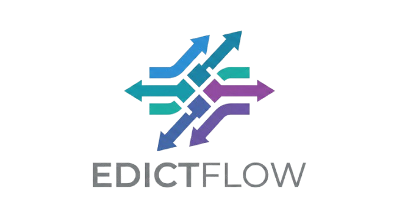

<!-- Improved compatibility of back to top link: See: https://github.com/othneildrew/Best-README-Template/pull/73 -->
<a id="readme-top"></a>

[![CI][ci-shield]][ci-url]
[![Security][security-shield]][security-url]
[![Go Version][go-version-shield]][go-version-url]
[![License][license-shield]][license-url]
[![Contributors][contributors-shield]][contributors-url]
[![Issues][issues-shield]][issues-url]
[![Forks][forks-shield]][forks-url]
[![Stars][stars-shield]][stars-url]
[![Last Commit][last-commit-shield]][last-commit-url]

<!-- PROJECT LOGO -->
<br />
<div align="center">
  <a href="https://github.com/kamilrybacki/edictflow">
    
  </a>

  <p align="center">
    Centralized CLAUDE.md Configuration Management for Development Teams
    <br />
    <a href="https://kamilrybacki.github.io/edictflow"><strong>Explore the docs »</strong></a>
    <br />
    <br />
    <a href="https://github.com/kamilrybacki/edictflow/issues/new?labels=bug&template=bug_report.yml">Report Bug</a>
    ·
    <a href="https://github.com/kamilrybacki/edictflow/issues/new?labels=enhancement&template=feature_request.yml">Request Feature</a>
  </p>
</div>

<!-- TABLE OF CONTENTS -->
<details>
  <summary>Table of Contents</summary>
  <ol>
    <li>
      <a href="#about-the-project">About The Project</a>
      <ul>
        <li><a href="#key-features">Key Features</a></li>
        <li><a href="#built-with">Built With</a></li>
      </ul>
    </li>
    <li>
      <a href="#getting-started">Getting Started</a>
      <ul>
        <li><a href="#prerequisites">Prerequisites</a></li>
        <li><a href="#server-deployment">Server Deployment</a></li>
        <li><a href="#agent-installation">Agent Installation</a></li>
      </ul>
    </li>
    <li><a href="#usage">Usage</a></li>
    <li><a href="#architecture">Architecture</a></li>
    <li><a href="#roadmap">Roadmap</a></li>
    <li><a href="#contributing">Contributing</a></li>
    <li><a href="#license">License</a></li>
    <li><a href="#contact">Contact</a></li>
    <li><a href="#acknowledgments">Acknowledgments</a></li>
  </ol>
</details>

---

## About The Project

Edictflow is a centralized configuration management system designed specifically for managing **CLAUDE.md** files across development teams. It enables organizations to define, distribute, and enforce AI assistant configurations with real-time synchronization and granular access control.

### Key Features

| Feature | Description |
|---------|-------------|
| **Centralized Rule Management** | Define and manage configuration rules from a single admin interface |
| **Real-time Synchronization** | Changes propagate instantly to all connected agents via WebSocket |
| **Enforcement Modes** | Choose between blocking, temporary, or warning modes for each rule |
| **Role-Based Access Control** | Fine-grained permissions with hierarchical roles |
| **Audit Logging** | Complete visibility into all configuration changes |
| **Multi-Team Support** | Organize users and rules by teams |
| **Change Requests** | Approval workflows for rule modifications |
| **Exception Management** | Handle one-off deviations with tracked exceptions |

<p align="right">(<a href="#readme-top">back to top</a>)</p>

### Built With

**Backend:**

[![Go][Go-shield]][Go-url]
[![PostgreSQL][PostgreSQL-shield]][PostgreSQL-url]
[![Redis][Redis-shield]][Redis-url]
[![Docker][Docker-shield]][Docker-url]

**Frontend:**

[![Next.js][Next.js-shield]][Next-url]
[![React][React-shield]][React-url]
[![TypeScript][TypeScript-shield]][TypeScript-url]
[![Tailwind CSS][TailwindCSS-shield]][TailwindCSS-url]

<p align="right">(<a href="#readme-top">back to top</a>)</p>

---

## Getting Started

### Prerequisites

**For Server Deployment:**
* Docker and Docker Compose
* Or: Go 1.24+, Node.js 22+, PostgreSQL 15+, Redis

**For Agent:**
* Linux, macOS, or Windows
* Network access to your Edictflow server

### Server Deployment

#### Option 1: Docker Compose (Recommended)

```bash
# Download production compose file
curl -O https://raw.githubusercontent.com/kamilrybacki/edictflow/main/docker-compose.prod.yml
curl -O https://raw.githubusercontent.com/kamilrybacki/edictflow/main/.env.example

# Configure environment
cp .env.example .env
# Edit .env with your settings (database credentials, JWT secret, etc.)

# Start the stack
docker compose -f docker-compose.prod.yml up -d
```

#### Option 2: From Source

```bash
# Clone the repository
git clone https://github.com/kamilrybacki/edictflow.git
cd edictflow

# Start development environment (requires Task)
task dev

# Or build manually
cd server && go build -o ../bin/edictflow-server ./cmd/master
cd ../web && npm install && npm run build
```

### Agent Installation

#### One-liner Install (Linux/macOS)

```bash
curl -sSL https://raw.githubusercontent.com/kamilrybacki/edictflow/main/scripts/install-agent.sh | bash
```

#### Manual Install

```bash
# Download for your platform
curl -fsSL https://github.com/kamilrybacki/edictflow/releases/latest/download/agent-$(uname -s | tr '[:upper:]' '[:lower:]')-$(uname -m) -o edictflow-agent
chmod +x edictflow-agent

# Authenticate
./edictflow-agent login https://your-server.example.com

# Start the daemon
./edictflow-agent start
```

<p align="right">(<a href="#readme-top">back to top</a>)</p>

---

## Usage

### Web Interface

Access the web UI at `http://localhost:3000` (or your configured domain) to:

- **Manage Rules** - Create, edit, and organize CLAUDE.md configuration rules
- **View Teams** - Organize users and assign permissions
- **Review Changes** - Approve or reject change requests
- **Audit Activity** - Track all modifications with full audit trail

### Agent CLI

```bash
# Check agent status
edictflow-agent status

# Sync rules immediately
edictflow-agent sync

# View current configuration
edictflow-agent config

# Watch for changes in real-time
edictflow-agent watch
```

### API

Full REST API available at `/api/v1/`. See the [API Documentation](https://kamilrybacki.github.io/edictflow/api/) for details.

```bash
# Example: List all rules
curl -H "Authorization: Bearer $TOKEN" https://your-server/api/v1/rules

# Example: Get rule by ID
curl -H "Authorization: Bearer $TOKEN" https://your-server/api/v1/rules/{id}
```

<p align="right">(<a href="#readme-top">back to top</a>)</p>

---

## Architecture

```
┌─────────────────────────────────────────────────────────────────┐
│                         Admin Layer                              │
│  ┌─────────────┐  ┌─────────────┐  ┌─────────────────────────┐  │
│  │   Web UI    │  │  REST API   │  │  WebSocket Server       │  │
│  │  (Next.js)  │  │   (Go)      │  │  (Real-time sync)       │  │
│  └──────┬──────┘  └──────┬──────┘  └───────────┬─────────────┘  │
└─────────┼────────────────┼─────────────────────┼────────────────┘
          │                │                     │
          ▼                ▼                     ▼
┌─────────────────────────────────────────────────────────────────┐
│                        Server Core                               │
│  ┌─────────────┐  ┌─────────────┐  ┌─────────────────────────┐  │
│  │    Auth     │  │   Rules     │  │     Audit               │  │
│  │  Service    │  │   Engine    │  │     Service             │  │
│  └──────┬──────┘  └──────┬──────┘  └───────────┬─────────────┘  │
└─────────┼────────────────┼─────────────────────┼────────────────┘
          │                │                     │
          ▼                ▼                     ▼
┌─────────────────────────────────────────────────────────────────┐
│                        Data Layer                                │
│  ┌─────────────────────────────┐  ┌─────────────────────────┐   │
│  │        PostgreSQL           │  │         Redis           │   │
│  │   (Rules, Users, Audit)     │  │  (Sessions, Rate Limit) │   │
│  └─────────────────────────────┘  └─────────────────────────┘   │
└─────────────────────────────────────────────────────────────────┘
          ▲                ▲                     ▲
          │                │                     │
          │      WebSocket Connection            │
          │                │                     │
┌─────────┴────────────────┴─────────────────────┴────────────────┐
│                        Agent Layer                               │
│  ┌─────────────┐  ┌─────────────┐  ┌─────────────────────────┐  │
│  │   Agent 1   │  │   Agent 2   │  │      Agent N...         │  │
│  │  (Go CLI)   │  │  (Go CLI)   │  │      (Go CLI)           │  │
│  └─────────────┘  └─────────────┘  └─────────────────────────┘  │
└─────────────────────────────────────────────────────────────────┘
```

<p align="right">(<a href="#readme-top">back to top</a>)</p>

---

## Roadmap

- [x] Core rule management and CRUD operations
- [x] Real-time WebSocket synchronization
- [x] Role-based access control (RBAC)
- [x] Audit logging
- [x] Change request workflows
- [x] Exception management
- [x] Multi-team support
- [x] Docker deployment
- [x] CI/CD pipelines
- [ ] Rule versioning and rollback
- [ ] Rule templates and library
- [ ] Slack/Teams notifications
- [ ] SSO integration (OIDC/SAML)
- [ ] Terraform provider
- [ ] Kubernetes Helm chart

See the [open issues](https://github.com/kamilrybacki/edictflow/issues) for a full list of proposed features and known issues.

<p align="right">(<a href="#readme-top">back to top</a>)</p>

---

## Contributing

Contributions are what make the open source community amazing. Any contributions you make are **greatly appreciated**.

1. Fork the Project
2. Create your Feature Branch (`git checkout -b feature/AmazingFeature`)
3. Commit your Changes (`git commit -m 'Add some AmazingFeature'`)
4. Push to the Branch (`git push origin feature/AmazingFeature`)
5. Open a Pull Request

### Development Setup

```bash
# Clone your fork
git clone https://github.com/your-username/edictflow.git
cd edictflow

# Install dependencies
task setup

# Start development environment
task dev

# Run tests
task test

# Run linters
task lint
```

See [Development Guide](https://kamilrybacki.github.io/edictflow/development/) for detailed instructions.

<p align="right">(<a href="#readme-top">back to top</a>)</p>

---

## License

Distributed under the MIT License. See `LICENSE` for more information.

<p align="right">(<a href="#readme-top">back to top</a>)</p>

---

## Contact

Kamil Rybacki - [@kamilrybacki](https://github.com/kamilrybacki)

Project Link: [https://github.com/kamilrybacki/edictflow](https://github.com/kamilrybacki/edictflow)

<p align="right">(<a href="#readme-top">back to top</a>)</p>

---

## Acknowledgments

* [Best-README-Template](https://github.com/othneildrew/Best-README-Template)
* [Img Shields](https://shields.io)
* [Gorilla WebSocket](https://github.com/gorilla/websocket)
* [Echo Framework](https://echo.labstack.com/)
* [Next.js](https://nextjs.org/)
* [Tailwind CSS](https://tailwindcss.com/)
* [Lucide Icons](https://lucide.dev/)

<p align="right">(<a href="#readme-top">back to top</a>)</p>

<!-- MARKDOWN LINKS & IMAGES -->
[ci-shield]: https://img.shields.io/github/actions/workflow/status/kamilrybacki/edictflow/ci.yml?label=CI
[ci-url]: https://github.com/kamilrybacki/edictflow/actions/workflows/ci.yml
[security-shield]: https://img.shields.io/github/actions/workflow/status/kamilrybacki/edictflow/security.yml?label=Security
[security-url]: https://github.com/kamilrybacki/edictflow/actions/workflows/security.yml
[go-version-shield]: https://img.shields.io/github/go-mod/go-version/kamilrybacki/edictflow?filename=server%2Fgo.mod
[go-version-url]: https://go.dev/
[license-shield]: https://img.shields.io/github/license/kamilrybacki/edictflow
[license-url]: https://github.com/kamilrybacki/edictflow/blob/main/LICENSE
[contributors-shield]: https://img.shields.io/github/contributors/kamilrybacki/edictflow
[contributors-url]: https://github.com/kamilrybacki/edictflow/graphs/contributors
[issues-shield]: https://img.shields.io/github/issues/kamilrybacki/edictflow
[issues-url]: https://github.com/kamilrybacki/edictflow/issues
[forks-shield]: https://img.shields.io/github/forks/kamilrybacki/edictflow
[forks-url]: https://github.com/kamilrybacki/edictflow/network/members
[stars-shield]: https://img.shields.io/github/stars/kamilrybacki/edictflow
[stars-url]: https://github.com/kamilrybacki/edictflow/stargazers
[last-commit-shield]: https://img.shields.io/github/last-commit/kamilrybacki/edictflow
[last-commit-url]: https://github.com/kamilrybacki/edictflow/commits/main

<!-- TECH STACK BADGES -->
[Go-shield]: https://img.shields.io/badge/Go-00ADD8?logo=go&logoColor=white
[Go-url]: https://go.dev/
[PostgreSQL-shield]: https://img.shields.io/badge/PostgreSQL-316192?logo=postgresql&logoColor=white
[PostgreSQL-url]: https://www.postgresql.org/
[Redis-shield]: https://img.shields.io/badge/Redis-DC382D?logo=redis&logoColor=white
[Redis-url]: https://redis.io/
[Docker-shield]: https://img.shields.io/badge/Docker-2496ED?logo=docker&logoColor=white
[Docker-url]: https://www.docker.com/
[Next.js-shield]: https://img.shields.io/badge/Next.js-000000?logo=nextdotjs&logoColor=white
[Next-url]: https://nextjs.org/
[React-shield]: https://img.shields.io/badge/React-20232A?logo=react&logoColor=61DAFB
[React-url]: https://reactjs.org/
[TypeScript-shield]: https://img.shields.io/badge/TypeScript-007ACC?logo=typescript&logoColor=white
[TypeScript-url]: https://www.typescriptlang.org/
[TailwindCSS-shield]: https://img.shields.io/badge/Tailwind_CSS-38B2AC?logo=tailwind-css&logoColor=white
[TailwindCSS-url]: https://tailwindcss.com/
