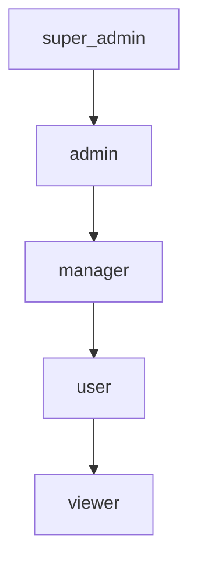

# Roles & Permissions

Edictflow uses Role-Based Access Control (RBAC) to manage user permissions.

## Permission Model

Permissions are organized hierarchically:



Higher roles inherit all permissions from lower roles.

## Built-in Roles

### Super Admin

Full system access. Typically reserved for platform administrators.

| Permission | Description |
|------------|-------------|
| `*` | All permissions |
| `manage_system` | System configuration |
| `manage_roles` | Create/modify roles |

### Admin

Team administration capabilities.

| Permission | Description |
|------------|-------------|
| `manage_users` | Create/modify users |
| `manage_teams` | Create/modify teams |
| `manage_rules` | Full rule management |
| `approve_changes` | Approve change requests |
| `view_audit` | View audit logs |

### Manager

Rule and approval management.

| Permission | Description |
|------------|-------------|
| `create_rules` | Create new rules |
| `edit_rules` | Modify existing rules |
| `approve_changes` | Approve change requests |
| `view_team_users` | View team members |

### User

Standard user with change request capability.

| Permission | Description |
|------------|-------------|
| `view_rules` | View assigned rules |
| `request_changes` | Request rule changes |
| `view_changes` | View change history |
| `manage_agent` | Manage own agent |

### Viewer

Read-only access.

| Permission | Description |
|------------|-------------|
| `view_rules` | View assigned rules |
| `view_changes` | View change history |

## Permission Reference

### System Permissions

| Permission | Description |
|------------|-------------|
| `manage_system` | Modify system settings |
| `manage_roles` | Create/edit roles |
| `manage_teams` | Create/edit teams |
| `manage_users` | Create/edit users |
| `view_audit` | View audit logs |

### Rule Permissions

| Permission | Description |
|------------|-------------|
| `manage_rules` | Full CRUD on rules |
| `create_rules` | Create new rules |
| `edit_rules` | Modify rules |
| `delete_rules` | Delete rules |
| `view_rules` | View rules |

### Change Permissions

| Permission | Description |
|------------|-------------|
| `approve_changes` | Approve/reject changes |
| `request_changes` | Submit change requests |
| `view_changes` | View change history |

### Agent Permissions

| Permission | Description |
|------------|-------------|
| `manage_agents` | Manage all agents |
| `manage_agent` | Manage own agent |
| `view_agents` | View agent status |

## Custom Roles

Create custom roles to match your organization's needs.

### Create Role via API

```bash
curl -X POST https://api.example.com/api/v1/roles \
  -H "Authorization: Bearer $TOKEN" \
  -H "Content-Type: application/json" \
  -d '{
    "name": "lead_developer",
    "description": "Team lead with rule creation rights",
    "permissions": [
      "view_rules",
      "create_rules",
      "edit_rules",
      "view_changes",
      "request_changes",
      "view_team_users"
    ]
  }'
```

### Create Role via Web UI

1. Navigate to **Settings** → **Roles**
2. Click **Create Role**
3. Enter role details:
   - Name
   - Description
   - Select permissions
4. Click **Create**

### Role Hierarchy

Set role hierarchy for inheritance:

```bash
curl -X PATCH https://api.example.com/api/v1/roles/{role_id} \
  -H "Authorization: Bearer $TOKEN" \
  -H "Content-Type: application/json" \
  -d '{
    "parent_role_id": "user-role-uuid"
  }'
```

## Team-Scoped Permissions

Permissions can be scoped to specific teams:

```json
{
  "name": "engineering_admin",
  "permissions": [
    "manage_rules:team:engineering",
    "manage_users:team:engineering"
  ]
}
```

This grants admin rights only within the Engineering team.

## Permission Checks

### API Authorization

The server checks permissions on each request:

```go
// Example middleware check
if !user.HasPermission("manage_rules", teamID) {
    return Forbidden("insufficient permissions")
}
```

### Web UI

The UI hides elements based on permissions:

- Buttons/links require appropriate permissions
- Pages check access on load
- Actions validate server-side

## Examples

### Development Team Setup

```
super_admin (1 person)
├── Platform team admin
└── Can create new teams

admin (team leads)
├── Manage team members
├── Create and edit rules
└── Approve changes

developer (team members)
├── View rules
├── Request changes
└── Manage own agent
```

### Enterprise Setup

```
super_admin
├── Platform engineering

security_admin (custom role)
├── View all rules
├── Approve security-related changes
└── View audit logs

team_admin (per team)
├── Manage team users
├── Manage team rules
└── Cannot modify other teams

developer
├── Standard user permissions
└── Scoped to their team
```

## Audit

All permission-related actions are logged:

- Role assignments
- Permission changes
- Access denied events

Query audit logs:

```bash
curl "https://api.example.com/api/v1/audit?action=role_change" \
  -H "Authorization: Bearer $TOKEN"
```

## Best Practices

### Principle of Least Privilege

1. Start with minimal permissions
2. Add permissions as needed
3. Review permissions regularly
4. Remove unused permissions

### Role Design

1. Create roles for job functions, not individuals
2. Use team scoping for multi-team setups
3. Document role purposes
4. Avoid permission sprawl

### Regular Review

1. Quarterly permission audits
2. Review on team changes
3. Remove stale roles
4. Update for new features

## Troubleshooting

### Permission Denied

If a user can't access something:

1. Check their role: `GET /api/v1/users/{id}`
2. Check role permissions: `GET /api/v1/roles/{id}`
3. Verify team scope matches
4. Check for cached permissions (logout/login)

### Role Not Applying

1. Verify role assignment saved
2. Check role hierarchy (parent roles)
3. Clear any permission caches
4. Verify role is active
