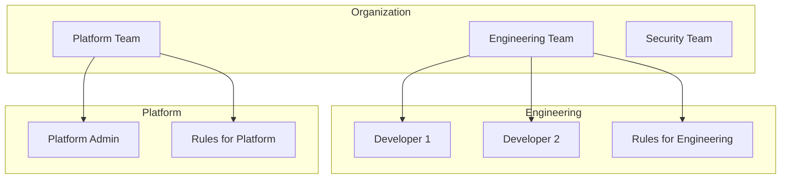

# User Management

Manage users, authentication, and team membership in Edictflow.

## User Model

Each user has:

| Field | Description |
|-------|-------------|
| Email | Unique email address |
| Name | Display name |
| Team | Primary team assignment |
| Role | Permission level |
| Auth Provider | How they authenticate (local, GitHub, Google) |
| Status | Active/Inactive |

## Creating Users

### Via Web UI

1. Navigate to **Users** → **Invite User**
2. Fill in user details:
   - Email address
   - Display name
   - Team assignment
   - Initial role
3. Click **Send Invitation**

The user receives an email with setup instructions.

### Via API

```bash
curl -X POST https://api.example.com/api/v1/users \
  -H "Authorization: Bearer $TOKEN" \
  -H "Content-Type: application/json" \
  -d '{
    "email": "user@example.com",
    "name": "New User",
    "team_id": "team-uuid",
    "role_id": "role-uuid"
  }'
```

### Bulk Import

Import users from CSV:

```csv
email,name,team,role
user1@example.com,User One,Engineering,developer
user2@example.com,User Two,Engineering,developer
admin@example.com,Admin User,Platform,admin
```

```bash
# Using the CLI
edictflow-admin users import users.csv
```

## Authentication

### Local Authentication

Password-based authentication for users without SSO:

1. User receives invitation email
2. Clicks link to set password
3. Logs in with email/password

Password requirements:

- Minimum 12 characters
- At least one uppercase letter
- At least one number
- At least one special character

### OAuth/SSO

Configure OAuth providers in [Configuration](configuration.md#oauth-configuration).

Supported providers:

| Provider | Setup Guide |
|----------|-------------|
| GitHub | [GitHub OAuth](configuration.md#github-oauth) |
| Google | [Google OAuth](configuration.md#google-oauth) |
| Custom OIDC | [Custom Provider](configuration.md#custom-oidc) |

### Device Code Flow (Agent CLI)

The agent CLI uses OAuth 2.0 Device Code flow:

1. User runs `agent login https://server.example.com`
2. Agent displays a code and URL
3. User opens URL in browser and enters code
4. User authenticates with their provider
5. Agent receives tokens

## Teams

Teams organize users and rules:



### Create Team

```bash
curl -X POST https://api.example.com/api/v1/teams \
  -H "Authorization: Bearer $TOKEN" \
  -H "Content-Type: application/json" \
  -d '{
    "name": "Engineering",
    "description": "Engineering team"
  }'
```

### Assign User to Team

```bash
curl -X PATCH https://api.example.com/api/v1/users/{user_id} \
  -H "Authorization: Bearer $TOKEN" \
  -H "Content-Type: application/json" \
  -d '{
    "team_id": "team-uuid"
  }'
```

### Multi-Team Membership

Users can belong to multiple teams:

```bash
curl -X POST https://api.example.com/api/v1/users/{user_id}/teams \
  -H "Authorization: Bearer $TOKEN" \
  -H "Content-Type: application/json" \
  -d '{
    "team_id": "additional-team-uuid"
  }'
```

## Roles and Permissions

See [Roles & Permissions](rbac.md) for detailed RBAC configuration.

Quick role assignment:

```bash
curl -X PATCH https://api.example.com/api/v1/users/{user_id} \
  -H "Authorization: Bearer $TOKEN" \
  -H "Content-Type: application/json" \
  -d '{
    "role_id": "role-uuid"
  }'
```

## User Lifecycle

### Onboarding

1. Admin creates user account
2. User receives invitation
3. User sets up authentication
4. User installs agent
5. User authenticates agent

### Offboarding

1. Deactivate user account
2. Revoke all sessions
3. Disconnect agents
4. Transfer ownership of resources

```bash
# Deactivate user
curl -X PATCH https://api.example.com/api/v1/users/{user_id} \
  -H "Authorization: Bearer $TOKEN" \
  -d '{"status": "inactive"}'

# Revoke sessions
curl -X DELETE https://api.example.com/api/v1/users/{user_id}/sessions \
  -H "Authorization: Bearer $TOKEN"
```

## Sessions

### View Active Sessions

```bash
curl https://api.example.com/api/v1/users/{user_id}/sessions \
  -H "Authorization: Bearer $TOKEN"
```

Response:

```json
{
  "sessions": [
    {
      "id": "session-uuid",
      "created_at": "2024-01-15T10:30:00Z",
      "last_active": "2024-01-15T14:22:00Z",
      "ip_address": "192.168.1.1",
      "user_agent": "edictflow-agent/1.0.0",
      "type": "agent"
    }
  ]
}
```

### Revoke Session

```bash
curl -X DELETE https://api.example.com/api/v1/sessions/{session_id} \
  -H "Authorization: Bearer $TOKEN"
```

## API Tokens

Generate API tokens for automation:

### Create Token

```bash
curl -X POST https://api.example.com/api/v1/users/{user_id}/tokens \
  -H "Authorization: Bearer $TOKEN" \
  -H "Content-Type: application/json" \
  -d '{
    "name": "CI/CD Token",
    "expires_at": "2025-01-15T00:00:00Z",
    "permissions": ["read:rules", "write:changes"]
  }'
```

Response:

```json
{
  "id": "token-uuid",
  "token": "ccp_xxxxxxxxxxxx",
  "name": "CI/CD Token",
  "expires_at": "2025-01-15T00:00:00Z"
}
```

!!! warning "Token Security"
    The token is only shown once. Store it securely.

### List Tokens

```bash
curl https://api.example.com/api/v1/users/{user_id}/tokens \
  -H "Authorization: Bearer $TOKEN"
```

### Revoke Token

```bash
curl -X DELETE https://api.example.com/api/v1/tokens/{token_id} \
  -H "Authorization: Bearer $TOKEN"
```

## Audit Trail

All user actions are logged. View in:

- Web UI: **Changes** section
- API: `GET /api/v1/audit?user_id={user_id}`

Logged actions:

- Login/logout
- Resource creation/modification
- Role changes
- Team assignments

## Best Practices

### Password Policies

1. Enforce strong passwords (see requirements above)
2. Require password rotation (90 days recommended)
3. Prevent password reuse (last 10 passwords)

### Access Control

1. Follow principle of least privilege
2. Review permissions quarterly
3. Promptly offboard departing users
4. Use SSO when possible

### Monitoring

1. Alert on failed login attempts
2. Monitor for unusual access patterns
3. Review session activity regularly
4. Track API token usage
