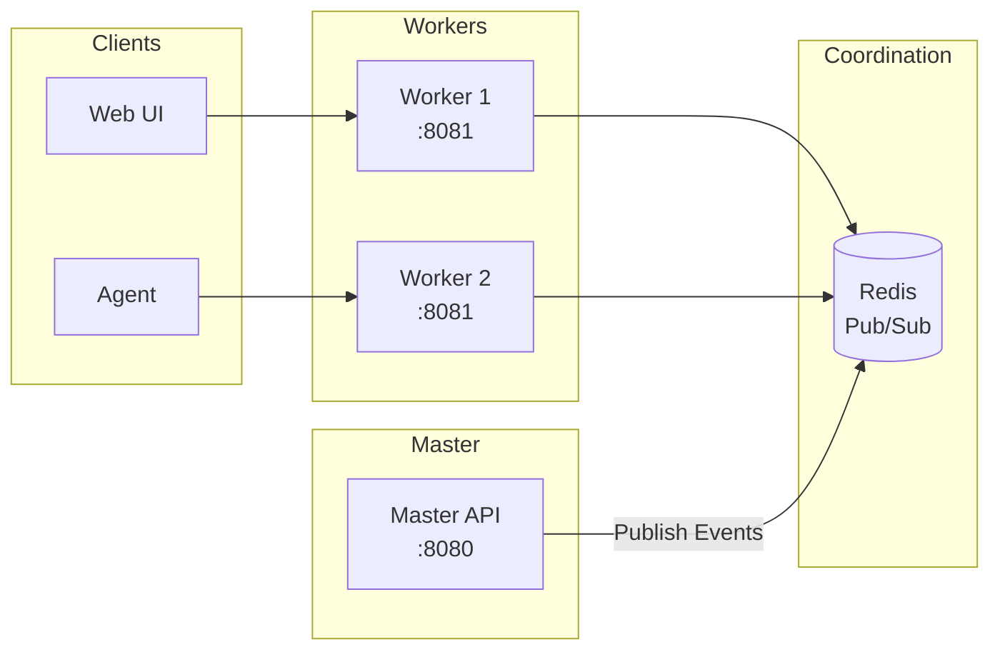

# WebSocket API

Real-time event streaming and bidirectional communication via dedicated worker processes.

## Architecture

In the master-worker architecture, WebSocket connections are handled by **worker** processes, separate from the master API:



**Key points:**

- Workers handle WebSocket connections (port 8081 by default)
- Masters handle REST API (port 8080)
- Redis pub/sub coordinates events between masters and workers
- Agents can connect to any worker and receive team events

## Connection

Connect to a worker WebSocket endpoint:

```
wss://ws.example.com/ws
```

Or in development:

```
ws://localhost:8081/ws
```

!!! note "Endpoint Difference"
    The WebSocket endpoint is on workers (port 8081), not the master API (port 8080).

### Authentication

Include the JWT token as a query parameter or in the first message:

**Query Parameter:**

```
wss://ws.example.com/ws?token=<jwt-token>
```

**First Message:**

```json
{
  "type": "auth",
  "token": "<jwt-token>"
}
```

### Connection Example

```javascript
const token = 'your-jwt-token';
const ws = new WebSocket(`wss://ws.example.com/ws?token=${token}`);

ws.onopen = () => {
  console.log('Connected to worker');
};

ws.onmessage = (event) => {
  const message = JSON.parse(event.data);
  console.log('Received:', message);
};

ws.onerror = (error) => {
  console.error('WebSocket error:', error);
};

ws.onclose = (event) => {
  console.log('Disconnected:', event.code, event.reason);
};
```

## Message Format

All messages are JSON with a `type` field:

```json
{
  "type": "message_type",
  "data": { ... },
  "timestamp": "2024-01-15T14:30:00Z"
}
```

## Event Types

The following events are published via Redis and broadcast to connected agents:

| Event Type | Description | Channel |
|------------|-------------|---------|
| `rule_created` | New rule created | `team:{team_id}:rules` |
| `rule_updated` | Rule content or settings changed | `team:{team_id}:rules` |
| `rule_deleted` | Rule removed | `team:{team_id}:rules` |
| `category_updated` | Category modified | `team:{team_id}:categories` |
| `sync_required` | Full sync needed | `broadcast:all` |

## Client Messages

### Subscribe to Events

```json
{
  "type": "subscribe",
  "channel": "changes",
  "filters": {
    "team_id": "team-uuid",
    "event_type": ["change_blocked", "change_detected"]
  }
}
```

### Unsubscribe

```json
{
  "type": "unsubscribe",
  "channel": "changes"
}
```

### Ping

```json
{
  "type": "ping"
}
```

## Server Messages

### Connection Confirmed

```json
{
  "type": "connected",
  "data": {
    "user_id": "user-uuid",
    "session_id": "session-uuid"
  }
}
```

### Subscription Confirmed

```json
{
  "type": "subscribed",
  "channel": "changes",
  "filters": {
    "team_id": "team-uuid"
  }
}
```

### Pong

```json
{
  "type": "pong"
}
```

### Error

```json
{
  "type": "error",
  "error": {
    "code": "INVALID_CHANNEL",
    "message": "Unknown channel: invalid"
  }
}
```

## Event Channels

### changes

Real-time configuration change events.

**Subscribe:**

```json
{
  "type": "subscribe",
  "channel": "changes",
  "filters": {
    "team_id": "team-uuid"
  }
}
```

**Events:**

```json
{
  "type": "change_blocked",
  "data": {
    "change_id": "change-uuid",
    "rule_id": "rule-uuid",
    "rule_name": "Standard CLAUDE.md",
    "file_path": "/project/CLAUDE.md",
    "user_email": "developer@example.com",
    "agent_hostname": "dev-laptop"
  },
  "timestamp": "2024-01-15T14:30:00Z"
}
```

### rules

Rule updates and synchronization.

**Subscribe:**

```json
{
  "type": "subscribe",
  "channel": "rules",
  "filters": {
    "team_id": "team-uuid"
  }
}
```

**Events:**

```json
{
  "type": "rule_updated",
  "data": {
    "rule_id": "rule-uuid",
    "rule_name": "Standard CLAUDE.md",
    "version": 4,
    "updated_by": "admin@example.com"
  },
  "timestamp": "2024-01-15T14:30:00Z"
}
```

### approvals

Approval workflow events.

**Subscribe:**

```json
{
  "type": "subscribe",
  "channel": "approvals",
  "filters": {
    "team_id": "team-uuid"
  }
}
```

**Events:**

```json
{
  "type": "approval_required",
  "data": {
    "approval_id": "approval-uuid",
    "change_id": "change-uuid",
    "rule_name": "Standard CLAUDE.md",
    "requester": "developer@example.com"
  },
  "timestamp": "2024-01-15T14:30:00Z"
}
```

### agents

Agent connection status.

**Subscribe:**

```json
{
  "type": "subscribe",
  "channel": "agents",
  "filters": {
    "team_id": "team-uuid"
  }
}
```

**Events:**

```json
{
  "type": "agent_connected",
  "data": {
    "agent_id": "agent-uuid",
    "hostname": "dev-laptop",
    "user_email": "developer@example.com"
  },
  "timestamp": "2024-01-15T14:30:00Z"
}
```

## Agent Protocol

The agent uses a specific protocol for synchronization with workers.

### Agent Authentication

```json
{
  "type": "agent_auth",
  "token": "<jwt-token>",
  "agent_id": "agent-uuid",
  "hostname": "dev-laptop",
  "version": "1.0.0"
}
```

### Sync Request

```json
{
  "type": "sync_request",
  "last_sync": "2024-01-15T14:00:00Z"
}
```

### Sync Response

```json
{
  "type": "sync_response",
  "data": {
    "rules": [
      {
        "id": "rule-uuid",
        "name": "Standard CLAUDE.md",
        "content": "# Content...",
        "enforcement_mode": "block",
        "triggers": [...],
        "version": 3
      }
    ],
    "sync_token": "sync-token-uuid"
  }
}
```

### Report Change

```json
{
  "type": "report_change",
  "data": {
    "rule_id": "rule-uuid",
    "file_path": "/project/CLAUDE.md",
    "event_type": "change_blocked",
    "old_content": "...",
    "new_content": "...",
    "timestamp": "2024-01-15T14:30:00Z"
  }
}
```

### Heartbeat

```json
{
  "type": "heartbeat",
  "data": {
    "rules_count": 3,
    "watched_files": 5,
    "uptime_seconds": 3600
  }
}
```

## Connection Management

### Keep-Alive

The server sends pings every 30 seconds (configurable via `WS_PING_INTERVAL`). Respond with pong:

```json
// Server sends
{"type": "ping"}

// Client responds
{"type": "pong"}
```

### Reconnection

On disconnect, implement exponential backoff:

```javascript
let reconnectDelay = 1000;
const maxDelay = 30000;

function reconnect() {
  setTimeout(() => {
    connect();
    reconnectDelay = Math.min(reconnectDelay * 2, maxDelay);
  }, reconnectDelay);
}

ws.onclose = () => {
  reconnect();
};

ws.onopen = () => {
  reconnectDelay = 1000; // Reset on successful connection
};
```

### Worker Load Balancing

With multiple workers, use sticky sessions for WebSocket connections:

```nginx
upstream workers {
    ip_hash;  # Sticky sessions
    server worker1:8081;
    server worker2:8081;
    server worker3:8081;
}

server {
    location /ws {
        proxy_pass http://workers;
        proxy_http_version 1.1;
        proxy_set_header Upgrade $http_upgrade;
        proxy_set_header Connection "upgrade";
        proxy_read_timeout 86400;
    }
}
```

!!! tip "Any Worker Works"
    While sticky sessions reduce reconnection overhead, agents can connect to any worker and still receive all events for their team via Redis pub/sub.

## Worker Health Check

Workers expose a health endpoint:

```bash
curl http://localhost:8081/health
```

Response:

```json
{
  "status": "ok",
  "agents": 5,
  "teams": 2,
  "subscriptions": 2
}
```

## Error Codes

| Code | Description |
|------|-------------|
| `AUTH_REQUIRED` | No authentication provided |
| `AUTH_FAILED` | Invalid token |
| `INVALID_MESSAGE` | Malformed message |
| `INVALID_CHANNEL` | Unknown channel |
| `PERMISSION_DENIED` | Insufficient permissions |
| `RATE_LIMITED` | Too many messages |

## Rate Limits

| Limit | Value |
|-------|-------|
| Messages per second | 10 |
| Subscriptions per connection | 20 |
| Connections per user | 5 |

## Example: Full Client

```javascript
class EdictflowWS {
  constructor(workerUrl, token) {
    this.url = workerUrl;  // Note: worker URL, not master API
    this.token = token;
    this.ws = null;
    this.handlers = {};
    this.reconnectDelay = 1000;
  }

  connect() {
    this.ws = new WebSocket(`${this.url}?token=${this.token}`);

    this.ws.onopen = () => {
      console.log('Connected to worker');
      this.reconnectDelay = 1000;
      this.emit('connected');
    };

    this.ws.onmessage = (event) => {
      const message = JSON.parse(event.data);

      if (message.type === 'ping') {
        this.send({ type: 'pong' });
        return;
      }

      this.emit(message.type, message.data);
    };

    this.ws.onclose = () => {
      this.reconnect();
    };
  }

  send(message) {
    if (this.ws?.readyState === WebSocket.OPEN) {
      this.ws.send(JSON.stringify(message));
    }
  }

  subscribe(channel, filters = {}) {
    this.send({
      type: 'subscribe',
      channel,
      filters
    });
  }

  on(type, handler) {
    if (!this.handlers[type]) {
      this.handlers[type] = [];
    }
    this.handlers[type].push(handler);
  }

  emit(type, data) {
    if (this.handlers[type]) {
      this.handlers[type].forEach(h => h(data));
    }
  }

  reconnect() {
    setTimeout(() => {
      this.connect();
      this.reconnectDelay = Math.min(this.reconnectDelay * 2, 30000);
    }, this.reconnectDelay);
  }
}

// Usage - note the worker URL
const client = new EdictflowWS('wss://ws.example.com/ws', token);

client.on('connected', () => {
  client.subscribe('changes', { team_id: 'team-uuid' });
});

client.on('change_blocked', (data) => {
  console.log('Change blocked:', data);
});

client.on('rule_updated', (data) => {
  console.log('Rule updated:', data);
});

client.connect();
```

## Redis Channel Reference

For internal reference, these are the Redis pub/sub channels used:

| Channel Pattern | Description |
|-----------------|-------------|
| `team:{team_id}:rules` | Rule events for a specific team |
| `team:{team_id}:categories` | Category events for a team |
| `broadcast:all` | Global events to all workers |
| `agent:{agent_id}:direct` | Direct messages to a specific agent |
