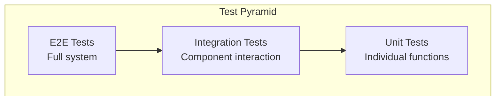

# Testing

Claudeception uses a multi-layer testing strategy: unit tests, integration tests, and E2E tests.

## Testing Strategy



| Layer | Purpose | Speed | Coverage Target |
|-------|---------|-------|-----------------|
| Unit | Individual functions | Fast | 80%+ |
| Integration | Component interaction | Medium | Key paths |
| E2E | Full system | Slow | Critical flows |

## Running Tests

### All Tests

```bash
task test
```

### Unit Tests Only

```bash
task test:unit
```

### Integration Tests

```bash
task test:integration
```

### E2E Tests

```bash
task e2e
```

### With Coverage

```bash
task test:coverage

# Opens coverage.html in browser
open server/coverage.html
```

## Unit Tests

### Server

Located in the same package as source code:

```
server/
├── services/
│   └── rules/
│       ├── service.go
│       └── service_test.go
```

Example test:

```go
func TestRulesService_Create(t *testing.T) {
    // Arrange
    mockRepo := mocks.NewMockRulesRepository(t)
    service := rules.NewService(mockRepo)

    rule := &rules.Rule{
        Name:    "Test Rule",
        Content: "# Test",
    }

    mockRepo.On("Create", mock.Anything, rule).Return(nil)

    // Act
    err := service.Create(context.Background(), rule)

    // Assert
    assert.NoError(t, err)
    mockRepo.AssertExpectations(t)
}
```

### Table-Driven Tests

Preferred style for testing multiple cases:

```go
func TestValidateEnforcementMode(t *testing.T) {
    tests := []struct {
        name     string
        mode     string
        wantErr  bool
    }{
        {"valid block", "block", false},
        {"valid temporary", "temporary", false},
        {"valid warning", "warning", false},
        {"invalid mode", "invalid", true},
        {"empty mode", "", true},
    }

    for _, tt := range tests {
        t.Run(tt.name, func(t *testing.T) {
            err := ValidateEnforcementMode(tt.mode)
            if tt.wantErr {
                assert.Error(t, err)
            } else {
                assert.NoError(t, err)
            }
        })
    }
}
```

### Agent

```bash
cd agent
go test ./...
```

## Integration Tests

Integration tests use real PostgreSQL via testcontainers.

### Running

```bash
task test:integration
```

### Location

```
server/integration/
├── repository_test.go
├── testhelpers/
│   └── fixtures.go
└── ...
```

### Example

```go
func TestRulesRepository_Integration(t *testing.T) {
    if testing.Short() {
        t.Skip("Skipping integration test")
    }

    // Start PostgreSQL container
    ctx := context.Background()
    container, db := testhelpers.SetupPostgres(t)
    defer container.Terminate(ctx)

    // Run migrations
    testhelpers.RunMigrations(t, db)

    // Create repository
    repo := postgres.NewRulesRepository(db)

    // Test
    t.Run("Create and Get", func(t *testing.T) {
        rule := &rules.Rule{
            Name:    "Test",
            Content: "# Test",
        }

        err := repo.Create(ctx, rule)
        require.NoError(t, err)

        got, err := repo.GetByID(ctx, rule.ID)
        require.NoError(t, err)
        assert.Equal(t, rule.Name, got.Name)
    })
}
```

## Distributed Worker Tests

The master-worker architecture requires specific tests for Redis pub/sub and worker hub functionality.

### Test Categories

| Category | Files | Purpose |
|----------|-------|---------|
| Redis Client | `adapters/redis/client_integration_test.go` | Connection, pub/sub, TTL |
| Event Publisher | `services/publisher/publisher_integration_test.go` | Event publishing to Redis |
| Worker Hub | `worker/hub_test.go`, `worker/handler_test.go` | Agent connections, broadcasts |
| Worker Integration | `integration/worker_test.go` | Multi-hub scaling, team isolation |

### Redis Client Tests

Tests Redis connectivity and pub/sub:

```go
func TestMultipleSubscribers(t *testing.T) {
    client, err := redisAdapter.NewClient("redis://localhost:6379/0")
    if err != nil {
        t.Skip("Redis not available:", err)
    }
    defer client.Close()

    ctx := context.Background()
    channel := "test:multi"

    // Create multiple subscribers
    sub1 := client.Subscribe(ctx, channel)
    sub2 := client.Subscribe(ctx, channel)
    defer sub1.Close()
    defer sub2.Close()

    // Both should receive the message
    go client.Publish(ctx, channel, "hello")

    // Verify both receive...
}
```

### Publisher Tests

Tests event publishing through Redis:

```go
func TestRedisPublisher_PublishRuleEvent(t *testing.T) {
    client := setupRedisClient(t)
    defer client.Close()

    ctx := context.Background()
    teamID := "test-team"
    channel := events.ChannelForTeam(teamID)

    sub := client.Subscribe(ctx, channel)
    defer sub.Close()

    publisher := publisher.NewRedisPublisher(client)
    go publisher.PublishRuleEvent(ctx, events.EventRuleUpdated, "rule-123", teamID)

    // Verify event received
    select {
    case msg := <-sub.Channel():
        event, _ := events.UnmarshalEvent([]byte(msg.Payload))
        assert.Equal(t, events.EventRuleUpdated, event.Type)
    case <-time.After(2 * time.Second):
        t.Error("timeout")
    }
}
```

### Worker Hub Tests

Tests agent registration and event broadcasting:

```go
func TestWorkerHubScaling(t *testing.T) {
    client := setupRedisClient(t)
    defer client.Close()

    // Create multiple worker hubs (simulating multiple workers)
    hub1 := worker.NewHub(client)
    hub2 := worker.NewHub(client)
    go hub1.Run()
    go hub2.Run()
    defer hub1.Stop()
    defer hub2.Stop()

    // Register agents on different hubs
    teamID := "shared-team"
    agent1 := &worker.AgentConn{ID: "conn-1", TeamID: teamID, Send: make(chan []byte, 10)}
    agent2 := &worker.AgentConn{ID: "conn-2", TeamID: teamID, Send: make(chan []byte, 10)}

    hub1.Register(agent1)
    hub2.Register(agent2)

    // Publish event - both hubs receive via Redis
    pub := publisher.NewRedisPublisher(client)
    pub.PublishRuleEvent(ctx, events.EventRuleUpdated, "rule-123", teamID)

    // Both agents should receive
    // ...
}
```

### Team Isolation Tests

Verify events are scoped to teams:

```go
func TestWorkerHubTeamIsolation(t *testing.T) {
    // Agents in different teams
    agentA := &worker.AgentConn{TeamID: "team-a", Send: teamAChan}
    agentB := &worker.AgentConn{TeamID: "team-b", Send: teamBChan}

    hub.Register(agentA)
    hub.Register(agentB)

    // Publish to team-a only
    pub.PublishRuleEvent(ctx, events.EventRuleCreated, "rule-for-a", "team-a")

    // Team A should receive
    select {
    case <-teamAChan:
        // Expected
    case <-time.After(2 * time.Second):
        t.Error("team-a should have received")
    }

    // Team B should NOT receive
    select {
    case <-teamBChan:
        t.Error("team-b should NOT have received")
    case <-time.After(500 * time.Millisecond):
        // Expected - no message
    }
}
```

### Running Distributed Worker Tests

Requires Redis:

```bash
# Start Redis
docker run -d --name redis-test -p 6379:6379 redis:7-alpine

# Run tests
go test -v ./server/adapters/redis/... ./server/services/publisher/... ./server/worker/... ./server/integration/...

# Or run integration tests only
go test -v ./server/integration/worker_test.go
```

Tests skip automatically if Redis is unavailable:

```go
client, err := redisAdapter.NewClient("redis://localhost:6379/0")
if err != nil {
    t.Skip("Redis not available:", err)
}
```

## E2E Tests

E2E tests use testcontainers-go to run the full system.

### Overview

Tests exercise:

1. Server API
2. Agent daemon
3. WebSocket sync
4. File enforcement

### Running

```bash
task e2e
```

Or directly:

```bash
cd e2e
go test -v -timeout 15m ./...
```

### Test Scenarios

#### Enforcement Modes

Tests verify all three enforcement modes:

1. **Block Mode**: File changes are reverted
2. **Temporary Mode**: Changes are allowed, events logged
3. **Warning Mode**: Changes logged without intervention

#### Swarm Sync

Tests verify multi-agent synchronization:

1. Multiple agents connect
2. Rule is updated
3. All agents receive update
4. File changes detected by all

### Structure

```
e2e/
├── suite_test.go           # Test suite setup
├── helpers_test.go         # Container helpers
├── seed_test.go            # Database seeding
├── api_helpers_test.go     # API interaction
├── enforcement_test.go     # Enforcement tests
├── swarm_suite_test.go     # Multi-agent suite
├── swarm_helpers_test.go   # Swarm helpers
├── swarm_sync_test.go      # Sync tests
└── run-e2e.sh              # Orchestration script
```

## Writing Tests

### Naming Convention

```go
// Function under test: Create
// Scenario: valid input
// Expected: success
func TestRulesService_Create_ValidInput_Success(t *testing.T)

// Or shorter
func TestCreate(t *testing.T) {
    t.Run("valid input returns success", func(t *testing.T) {
        // ...
    })
}
```

### Assertions

Use testify:

```go
import (
    "github.com/stretchr/testify/assert"
    "github.com/stretchr/testify/require"
)

// assert - continues on failure
assert.Equal(t, expected, actual)
assert.NoError(t, err)

// require - stops on failure
require.NoError(t, err)
require.NotNil(t, result)
```

### Mocking

Use mockery for generating mocks:

```bash
go install github.com/vektra/mockery/v2@latest

# Generate mocks
cd server
mockery --all
```

Usage:

```go
mockRepo := mocks.NewMockRepository(t)
mockRepo.On("Get", mock.Anything, "id").Return(entity, nil)
```

## Test Fixtures

### Shared Fixtures

Located in `testhelpers/fixtures.go`:

```go
func CreateTestTeam(t *testing.T, db *sql.DB) *Team {
    team := &Team{
        ID:   uuid.New(),
        Name: "Test Team",
    }
    _, err := db.Exec("INSERT INTO teams (id, name) VALUES ($1, $2)",
        team.ID, team.Name)
    require.NoError(t, err)
    return team
}
```

### Test Data Builders

```go
func NewRuleBuilder() *RuleBuilder {
    return &RuleBuilder{
        rule: &Rule{
            Name:            "Default Rule",
            Content:         "# Default",
            EnforcementMode: "block",
        },
    }
}

func (b *RuleBuilder) WithName(name string) *RuleBuilder {
    b.rule.Name = name
    return b
}

func (b *RuleBuilder) Build() *Rule {
    return b.rule
}

// Usage
rule := NewRuleBuilder().WithName("Custom").Build()
```

## Continuous Integration

Tests run on every PR:

```yaml
# .github/workflows/test.yml
jobs:
  test:
    runs-on: ubuntu-latest
    services:
      redis:
        image: redis:7-alpine
        ports:
          - 6379:6379
    steps:
      - uses: actions/checkout@v4
      - uses: actions/setup-go@v5
        with:
          go-version: '1.24'
      - name: Unit Tests
        run: task test:unit
      - name: Integration Tests
        run: task test:integration
      - name: Worker Tests
        run: go test -v ./server/integration/worker_test.go ./server/services/publisher/...
      - name: E2E Tests
        run: task e2e
```

## Coverage

### View Coverage

```bash
task test:coverage
open server/coverage.html
```

### Coverage Goals

| Package | Target |
|---------|--------|
| services/ | 80%+ |
| storage/ | 75%+ |
| handlers/ | 70%+ |
| worker/ | 75%+ |
| adapters/redis/ | 70%+ |
| Overall | 75%+ |

### Exclude from Coverage

Files that don't need coverage:

- Generated code (`*_gen.go`)
- Test helpers (`*_test.go`)
- Main entrypoints (`main.go`)

## Debugging Tests

### Run Single Test

```bash
go test -v -run TestRulesService_Create ./services/rules/
```

### Run with Debug Output

```bash
go test -v ./... 2>&1 | tee test.log
```

### Run E2E with Preserved Containers

```bash
cd e2e
TESTCONTAINERS_RYUK_DISABLED=1 go test -v -run TestEnforcement
# Containers remain for inspection
```

### Debug Worker Tests

```bash
# Start Redis in foreground to see logs
docker run --rm -p 6379:6379 redis:7-alpine

# In another terminal, run tests with verbose output
go test -v -count=1 ./server/integration/worker_test.go

# Monitor Redis pub/sub
redis-cli MONITOR
```

## Best Practices

1. **Test behavior, not implementation**
2. **One assertion per test** (when practical)
3. **Use meaningful test names**
4. **Keep tests independent**
5. **Clean up test data**
6. **Use table-driven tests for multiple cases**
7. **Mock external dependencies**
8. **Don't test third-party code**
9. **Skip tests gracefully when dependencies unavailable**
10. **Use timeouts for async operations**
