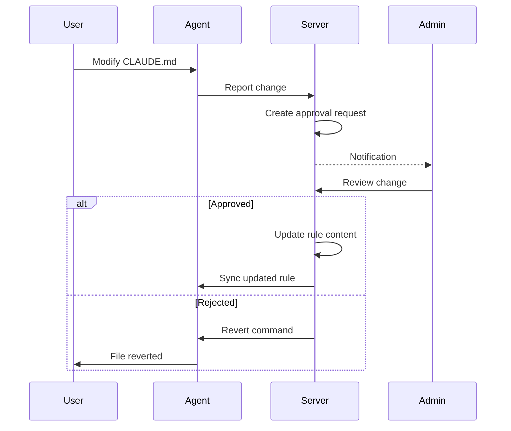

# Approvals

The approval workflow enables review and approval of configuration changes before they're accepted as the new standard.

## Overview

Approvals are used when:

- A rule is in **temporary mode**
- A user requests a rule modification
- An admin requires review before changes take effect



## Approval States

| State | Description |
|-------|-------------|
| `pending` | Awaiting review |
| `approved` | Change accepted |
| `rejected` | Change denied |
| `changes_requested` | Modifications needed |
| `expired` | Timed out without action |

## Viewing Approvals

### Web UI

1. Navigate to **Approvals** in the sidebar
2. See list of pending approvals
3. Filter by:
   - Team
   - Status
   - Requester
   - Date

### API

```bash
# List pending approvals
curl "https://api.example.com/api/v1/approvals?status=pending" \
  -H "Authorization: Bearer $TOKEN"

# Filter by team
curl "https://api.example.com/api/v1/approvals?team_id=team-uuid&status=pending" \
  -H "Authorization: Bearer $TOKEN"

# Get specific approval
curl "https://api.example.com/api/v1/approvals/{id}" \
  -H "Authorization: Bearer $TOKEN"
```

### Response

```json
{
  "data": [
    {
      "id": "approval-uuid",
      "change_id": "change-uuid",
      "status": "pending",
      "requester": {
        "id": "user-uuid",
        "email": "developer@example.com"
      },
      "rule": {
        "id": "rule-uuid",
        "name": "Standard CLAUDE.md"
      },
      "created_at": "2024-01-15T14:30:00Z",
      "expires_at": "2024-01-22T14:30:00Z"
    }
  ]
}
```

## Approving Changes

### Via Web UI

1. Open the approval from the list
2. Review the change:
   - View diff (before/after)
   - Check who made the change
   - Review the affected rule
3. Choose action:
   - **Approve**: Accept the change
   - **Reject**: Deny with reason
   - **Request Changes**: Ask for modifications

### Via API

```bash
# Approve
curl -X POST "https://api.example.com/api/v1/approvals/{id}/approve" \
  -H "Authorization: Bearer $TOKEN" \
  -d '{
    "comment": "Approved - changes look good"
  }'

# Reject
curl -X POST "https://api.example.com/api/v1/approvals/{id}/reject" \
  -H "Authorization: Bearer $TOKEN" \
  -d '{
    "reason": "Change conflicts with security policy"
  }'

# Request changes
curl -X POST "https://api.example.com/api/v1/approvals/{id}/request-changes" \
  -H "Authorization: Bearer $TOKEN" \
  -d '{
    "comments": [
      "Please add the security guidelines section",
      "Fix typo in line 15"
    ]
  }'
```

## Approval Results

### When Approved

1. Change content becomes the new rule content
2. Rule version is incremented
3. Updated rule syncs to all agents
4. Approval is marked as `approved`

### When Rejected

1. Agent receives revert command
2. Original content is restored
3. User is notified
4. Approval is marked as `rejected`

### When Changes Requested

1. Approval status changes to `changes_requested`
2. User is notified with comments
3. User can submit updated content
4. Process repeats

## Approval Policies

Configure approval requirements per rule or team.

### Required Approvers

```bash
curl -X PATCH "https://api.example.com/api/v1/rules/{id}" \
  -H "Authorization: Bearer $TOKEN" \
  -d '{
    "approval_policy": {
      "required_approvers": 2,
      "approver_roles": ["admin", "manager"]
    }
  }'
```

### Auto-Approve

For trusted users:

```bash
curl -X PATCH "https://api.example.com/api/v1/rules/{id}" \
  -H "Authorization: Bearer $TOKEN" \
  -d '{
    "approval_policy": {
      "auto_approve_users": ["trusted-user-uuid"]
    }
  }'
```

### Expiration

Set timeout for pending approvals:

```bash
curl -X PATCH "https://api.example.com/api/v1/rules/{id}" \
  -H "Authorization: Bearer $TOKEN" \
  -d '{
    "approval_policy": {
      "expiration": "7d",
      "on_expire": "reject"
    }
  }'
```

## Notifications

### Email

Approvers receive email when:

- New approval is created
- Reminder for pending approvals
- Approval is about to expire

### Slack

Configure Slack notifications:

```bash
curl -X POST "https://api.example.com/api/v1/integrations/slack" \
  -H "Authorization: Bearer $TOKEN" \
  -d '{
    "webhook_url": "https://hooks.slack.com/...",
    "events": ["approval_created", "approval_urgent"],
    "channel": "#approvals"
  }'
```

### In-App

Badge on Approvals menu shows pending count.

## Bulk Actions

### Approve Multiple

```bash
curl -X POST "https://api.example.com/api/v1/approvals/bulk/approve" \
  -H "Authorization: Bearer $TOKEN" \
  -d '{
    "approval_ids": ["uuid-1", "uuid-2", "uuid-3"],
    "comment": "Batch approved"
  }'
```

### Reject Multiple

```bash
curl -X POST "https://api.example.com/api/v1/approvals/bulk/reject" \
  -H "Authorization: Bearer $TOKEN" \
  -d '{
    "approval_ids": ["uuid-1", "uuid-2"],
    "reason": "Bulk rejected - policy violation"
  }'
```

## Approval History

### View History

```bash
curl "https://api.example.com/api/v1/approvals/{id}/history" \
  -H "Authorization: Bearer $TOKEN"
```

Response:

```json
{
  "history": [
    {
      "timestamp": "2024-01-15T14:30:00Z",
      "action": "created",
      "actor": "developer@example.com"
    },
    {
      "timestamp": "2024-01-15T15:00:00Z",
      "action": "changes_requested",
      "actor": "admin@example.com",
      "comment": "Please update section 3"
    },
    {
      "timestamp": "2024-01-15T16:00:00Z",
      "action": "updated",
      "actor": "developer@example.com"
    },
    {
      "timestamp": "2024-01-15T17:00:00Z",
      "action": "approved",
      "actor": "admin@example.com"
    }
  ]
}
```

## Metrics

### Dashboard

View approval metrics:

- Pending approvals count
- Average time to approval
- Approval/rejection ratio
- Approvals by team

### API

```bash
curl "https://api.example.com/api/v1/approvals/stats" \
  -H "Authorization: Bearer $TOKEN"
```

Response:

```json
{
  "pending": 12,
  "approved_today": 8,
  "rejected_today": 2,
  "avg_time_to_approval": "4h 30m",
  "by_team": {
    "Engineering": {
      "pending": 8,
      "approved": 45,
      "rejected": 5
    }
  }
}
```

## Best Practices

### 1. Respond Promptly

Set expectations for approval turnaround:

- Critical changes: 4 hours
- Standard changes: 24 hours
- Low priority: 72 hours

### 2. Provide Context

When requesting approval, include:

- Why the change is needed
- Impact of the change
- Testing performed

### 3. Use Automation

For routine changes:

- Configure auto-approve for trusted users
- Set up expedited paths for minor updates

### 4. Delegate Appropriately

Assign approvers based on:

- Technical expertise
- Team ownership
- Change impact

### 5. Review Regularly

Monitor approval queue health:

- Avoid backlogs
- Rotate approvers to prevent bottlenecks
- Set up escalation for stuck approvals
