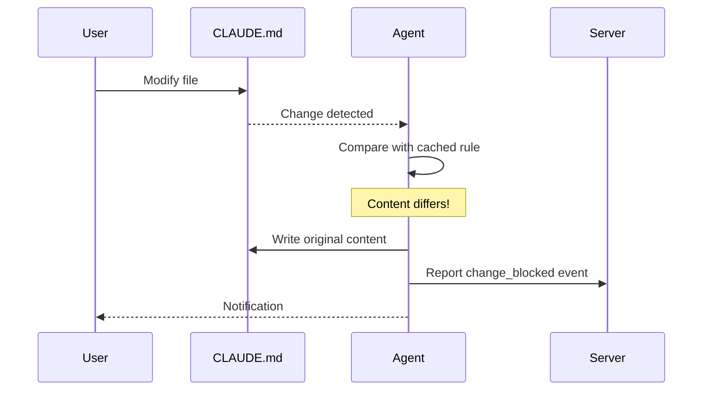
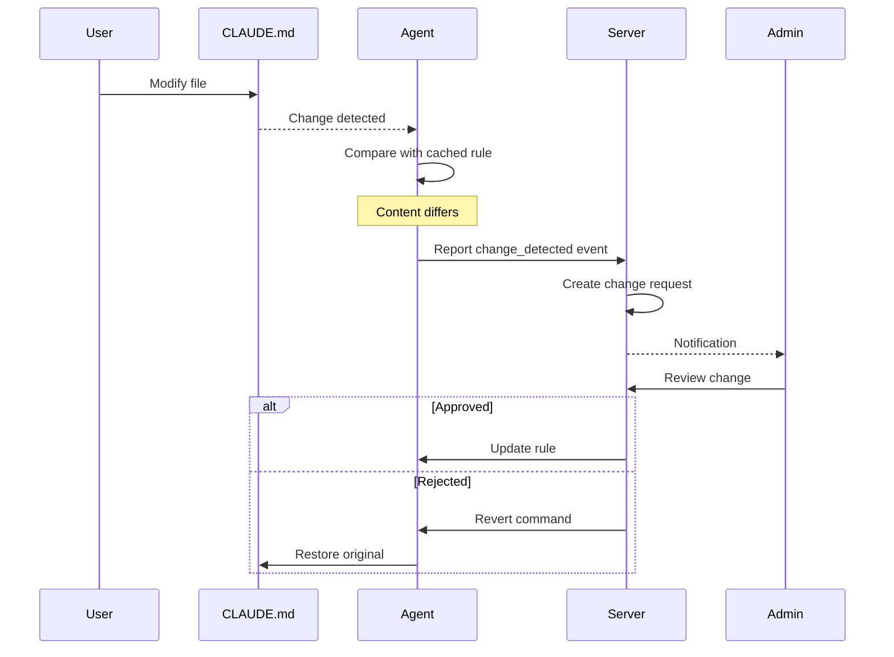
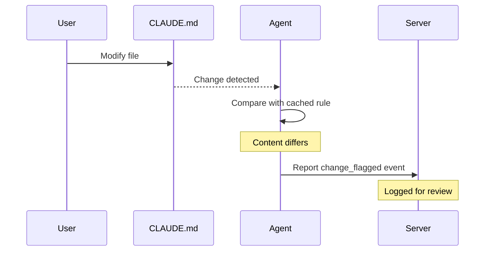

# Enforcement Modes

Edictflow provides three enforcement modes that determine how the agent responds to file changes.

## Overview

| Mode | Behavior | Use Case |
|------|----------|----------|
| **Block** | Immediately revert changes | Production configurations |
| **Temporary** | Allow changes, track for review | Development/testing |
| **Warning** | Log only, no intervention | Monitoring/gradual rollout |

## Block Mode

The strictest enforcement mode. Unauthorized changes are immediately reverted.

### How It Works



### Behavior

1. Agent detects file modification
2. Compares new content with cached rule content
3. If different: **immediately reverts** to original
4. Logs `change_blocked` event to server
5. User sees their changes disappear

### Configuration

```bash
curl -X PATCH https://api.example.com/api/v1/rules/{id} \
  -H "Authorization: Bearer $TOKEN" \
  -d '{"enforcement_mode": "block"}'
```

### When to Use

- **Production CLAUDE.md** that must not change
- **Security-critical configurations**
- **Compliance-required content**
- **Finalized team standards**

### Considerations

- Users cannot make even temporary changes
- May frustrate developers if overused
- Consider starting with Warning mode first
- Provide clear communication about why changes are blocked

## Temporary Mode

Allows changes but tracks them for review. Changes may require approval.

### How It Works



### Behavior

1. Agent detects file modification
2. Compares with cached rule content
3. If different: **keeps the change**
4. Logs `change_detected` event to server
5. Creates a change request
6. Admin reviews and approves/rejects

### Configuration

```bash
curl -X PATCH https://api.example.com/api/v1/rules/{id} \
  -H "Authorization: Bearer $TOKEN" \
  -d '{"enforcement_mode": "temporary"}'
```

### When to Use

- **Development environments** where experimentation is valuable
- **Gradual rollout** of new configurations
- **Collaborative editing** where input is welcomed
- **Testing** new CLAUDE.md content

### Approval Workflow

Changes in temporary mode can follow an approval workflow:

1. Change is made and logged
2. Appears in Approvals queue
3. Reviewer can:
   - **Approve**: Change becomes the new standard
   - **Reject**: Agent reverts the file
   - **Request Changes**: Ask for modifications

See [Approvals](approvals.md) for details.

## Warning Mode

Logs changes without any enforcement action.

### How It Works



### Behavior

1. Agent detects file modification
2. Compares with cached rule content
3. If different: **logs the change**
4. Reports `change_flagged` event to server
5. **No enforcement action taken**
6. File keeps user's changes

### Configuration

```bash
curl -X PATCH https://api.example.com/api/v1/rules/{id} \
  -H "Authorization: Bearer $TOKEN" \
  -d '{"enforcement_mode": "warning"}'
```

### When to Use

- **Initial deployment** to understand current state
- **Monitoring** compliance without disruption
- **Low-priority configurations**
- **Informational guidelines**
- **Gathering data** before enforcing

### Best for Discovery

Warning mode is excellent for:

- Learning how often files change
- Identifying which teams need attention
- Understanding patterns before enforcement
- Building the case for stricter modes

## Changing Enforcement Mode

### Gradual Rollout Pattern

Recommended approach for new rules:

```
Week 1-2: Warning Mode
  ↓ Review logs, understand patterns
Week 3-4: Temporary Mode
  ↓ Let changes happen, review and approve
Week 5+: Block Mode
  ↓ Full enforcement
```

### API for Mode Changes

```bash
# Check current mode
curl https://api.example.com/api/v1/rules/{id} \
  -H "Authorization: Bearer $TOKEN" | jq '.enforcement_mode'

# Update mode
curl -X PATCH https://api.example.com/api/v1/rules/{id} \
  -H "Authorization: Bearer $TOKEN" \
  -d '{"enforcement_mode": "temporary"}'
```

### Bulk Updates

Update multiple rules at once:

```bash
curl -X PATCH https://api.example.com/api/v1/rules/bulk \
  -H "Authorization: Bearer $TOKEN" \
  -d '{
    "rule_ids": ["uuid-1", "uuid-2", "uuid-3"],
    "enforcement_mode": "block"
  }'
```

## Comparison Table

| Aspect | Block | Temporary | Warning |
|--------|-------|-----------|---------|
| File reverted | Always | Sometimes | Never |
| Change logged | Yes | Yes | Yes |
| Approval required | N/A | Optional | No |
| User disruption | High | Low | None |
| Compliance guarantee | Strong | Medium | Weak |
| Discovery value | Low | Medium | High |

## Event Types by Mode

Each mode generates specific event types:

| Mode | Event Type | Description |
|------|------------|-------------|
| Block | `change_blocked` | Change was reverted |
| Temporary | `change_detected` | Change was allowed |
| Warning | `change_flagged` | Change was logged |

Query events by type:

```bash
curl "https://api.example.com/api/v1/changes?event_type=change_blocked" \
  -H "Authorization: Bearer $TOKEN"
```

## Best Practices

### 1. Start Permissive

Begin with warning mode to understand the current state:

- How often do files change?
- Who is making changes?
- What types of changes are common?

### 2. Communicate Before Enforcement

Before switching to block mode:

- Announce the change to affected teams
- Explain why enforcement is needed
- Provide a path for legitimate changes

### 3. Provide Escape Hatches

For block mode, ensure users know how to:

- Request rule modifications
- Get exceptions when needed
- Understand why changes are blocked

### 4. Monitor Rejection Rates

High rejection rates may indicate:

- Rules are too strict
- Rules don't match reality
- Better communication is needed
