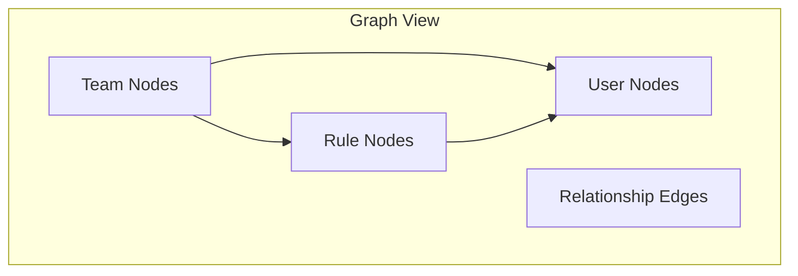

# Graph View

The Graph View provides an interactive visualization of your organization's hierarchy, showing relationships between teams, users, and rules.

## Overview

Access the Graph View at `/graph` or via the sidebar navigation.



## Features

### Node Types

The graph displays three types of nodes:

| Node Type | Color | Description |
|-----------|-------|-------------|
| **Team** | Blue | Organizational teams |
| **User** | Green | Team members |
| **Rule** | Orange | CLAUDE.md rules |

### Hierarchical Layout

Nodes are arranged in a hierarchical layout using the dagre algorithm:

```
        [Teams]         <- Top level
           |
        [Users]         <- Middle level
           |
        [Rules]         <- Bottom level
```

This layout makes it easy to understand:

- Which teams exist in your organization
- Which users belong to each team
- Which rules apply to each team/user

### Edges

Edges (connecting lines) show relationships:

| Edge Type | Meaning |
|-----------|---------|
| Team -> User | User is a member of the team |
| Rule -> Team | Rule targets the team |
| Rule -> User | Rule targets the user specifically |

## Controls

### Zoom and Pan

| Action | Mouse | Trackpad |
|--------|-------|----------|
| Zoom in | Scroll up | Pinch out |
| Zoom out | Scroll down | Pinch in |
| Pan | Click + drag | Two-finger drag |

### Control Panel

The control panel (bottom-left) provides:

| Button | Action |
|--------|--------|
| **+** | Zoom in |
| **-** | Zoom out |
| **Fit** | Fit all nodes in view |
| **Lock** | Lock current view |

### Keyboard Shortcuts

| Shortcut | Action |
|----------|--------|
| `Ctrl+K` / `Cmd+K` | Open command palette, type "graph" |
| `g` then `g` | Navigate to Graph View |
| `Esc` | Deselect node |

## Filtering

### Team Filter

Filter nodes by team:

1. Click the **Team** dropdown in the controls bar
2. Select a team name
3. Graph shows only nodes related to that team

### Status Filter

Filter rules by status:

| Status | Description |
|--------|-------------|
| **Draft** | Rules in draft state |
| **Pending** | Rules awaiting approval |
| **Approved** | Active, approved rules |

Toggle status filters:

1. Click status buttons in the controls bar
2. Selected statuses are highlighted
3. Graph shows only rules matching selected statuses

### Search

Find specific nodes:

1. Type in the search box
2. Matching nodes are highlighted
3. Non-matching nodes are dimmed

## Node Interactions

### Selection

Click a node to select it:

- Selected node is highlighted
- Connected edges are emphasized
- Connected nodes are highlighted
- Non-connected nodes are dimmed

### Node Details

When a node is selected:

- **Teams**: Shows member count, rule count
- **Users**: Shows team membership, email
- **Rules**: Shows enforcement mode, status, targets

### Navigation

Double-click a node to navigate:

- **Teams**: Opens team detail page
- **Users**: Opens user profile
- **Rules**: Opens rule editor

## Use Cases

### Understanding Rule Coverage

See which rules apply to which teams:

1. Navigate to Graph View
2. Select a rule node
3. Connected teams are highlighted
4. Verify expected coverage

### Auditing Team Structure

Review organizational hierarchy:

1. Filter by team
2. See all members and rules
3. Identify gaps in coverage

### Troubleshooting

When investigating issues:

1. Find the affected user/team
2. Select the node
3. See all connected rules
4. Identify the rule causing the issue

## Technical Details

### React Flow

The Graph View is built with [React Flow](https://reactflow.dev/):

- Custom node components for each type
- Dagre layout algorithm for positioning
- Smooth animations for interactions

### Performance

For large organizations:

- Nodes are virtualized (only visible nodes render)
- Edges use optimized path calculations
- Filtering reduces rendered elements

### Data Source

Graph data is fetched from `/api/graph`:

```typescript
interface GraphData {
  teams: GraphTeam[];
  users: GraphUser[];
  rules: GraphRule[];
}
```

## Accessibility

The Graph View supports:

- Keyboard navigation between nodes
- Screen reader announcements for selection
- High contrast mode support
- Reduced motion preference

## Related

- [Web UI Guide](../web-ui/index.md) - Complete UI documentation
- [Rules](rules.md) - Rule management
- [Teams API](../api/teams.md) - Teams API reference
