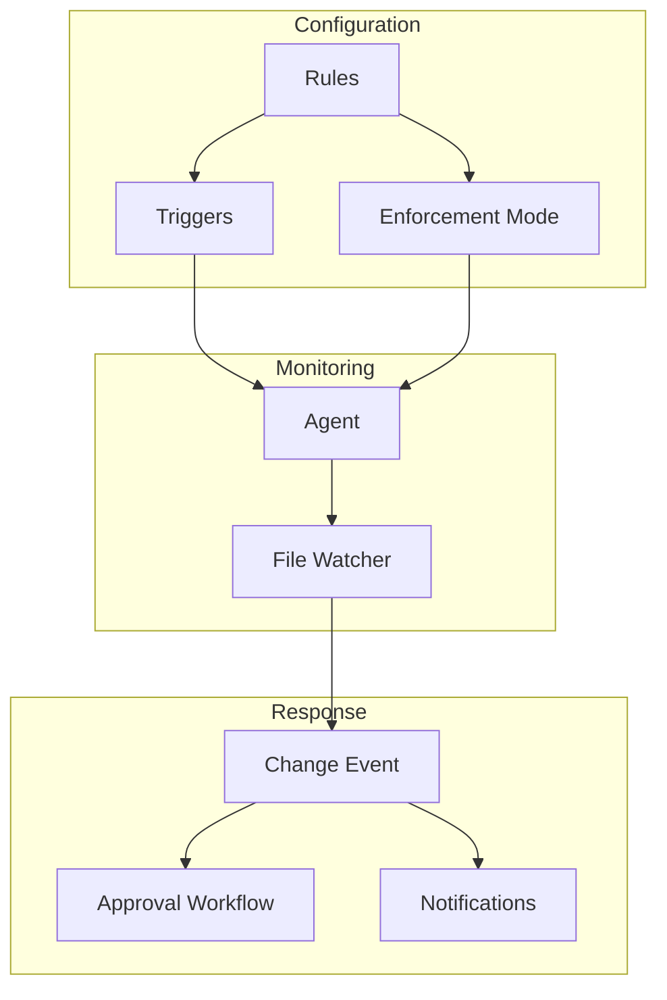

# Features

Edictflow provides a comprehensive set of features for managing CLAUDE.md configurations across your organization.

## Core Features

<div class="grid" markdown>

<div class="card" markdown>

### [Rules](rules.md)

Define and manage CLAUDE.md configuration rules with content, triggers, and metadata.

</div>

<div class="card" markdown>

### [Enforcement Modes](enforcement.md)

Choose how strictly rules are enforced: Block, Temporary, or Warning.

</div>

<div class="card" markdown>

### [Triggers](triggers.md)

Configure which files and paths each rule applies to using patterns and paths.

</div>

<div class="card" markdown>

### [Change Requests](changes.md)

Track and manage all configuration changes across your organization.

</div>

<div class="card" markdown>

### [Approvals](approvals.md)

Review and approve change requests before they're applied.

</div>

<div class="card" markdown>

### [Notifications](notifications.md)

Stay informed about changes, approvals, and system events.

</div>

</div>

## Feature Matrix

| Feature | Description | Availability |
|---------|-------------|--------------|
| Rules Management | Create and edit configuration rules | All plans |
| Real-time Sync | Instant rule propagation via WebSocket | All plans |
| Block Mode | Automatic revert of unauthorized changes | All plans |
| Temporary Mode | Allow changes with tracking | All plans |
| Warning Mode | Log-only monitoring | All plans |
| Audit Logging | Complete change history | All plans |
| RBAC | Role-based access control | All plans |
| API Access | REST API for automation | All plans |
| WebSocket API | Real-time event streaming | All plans |
| Multi-team | Support for multiple teams | All plans |

## How Features Work Together



## Quick Examples

### Create a Rule

```bash
curl -X POST https://api.example.com/api/v1/rules \
  -H "Authorization: Bearer $TOKEN" \
  -d '{
    "name": "Standard CLAUDE.md",
    "team_id": "team-uuid",
    "content": "# CLAUDE.md\n\nProject guidelines...",
    "enforcement_mode": "block",
    "triggers": [{"type": "path", "pattern": "CLAUDE.md"}]
  }'
```

### Monitor Changes

```bash
curl https://api.example.com/api/v1/changes?team_id=team-uuid \
  -H "Authorization: Bearer $TOKEN"
```

### Approve a Change

```bash
curl -X POST https://api.example.com/api/v1/approvals \
  -H "Authorization: Bearer $TOKEN" \
  -d '{
    "change_id": "change-uuid",
    "status": "approved",
    "comment": "Approved for production use"
  }'
```

## Getting Started

1. **[Create your first rule](rules.md#creating-a-rule)** - Define what content to enforce
2. **[Set enforcement mode](enforcement.md)** - Choose how strictly to enforce
3. **[Configure triggers](triggers.md)** - Specify which files to monitor
4. **[Deploy agents](../user/installation.md)** - Install on developer machines
5. **[Monitor changes](changes.md)** - Track compliance across your organization
