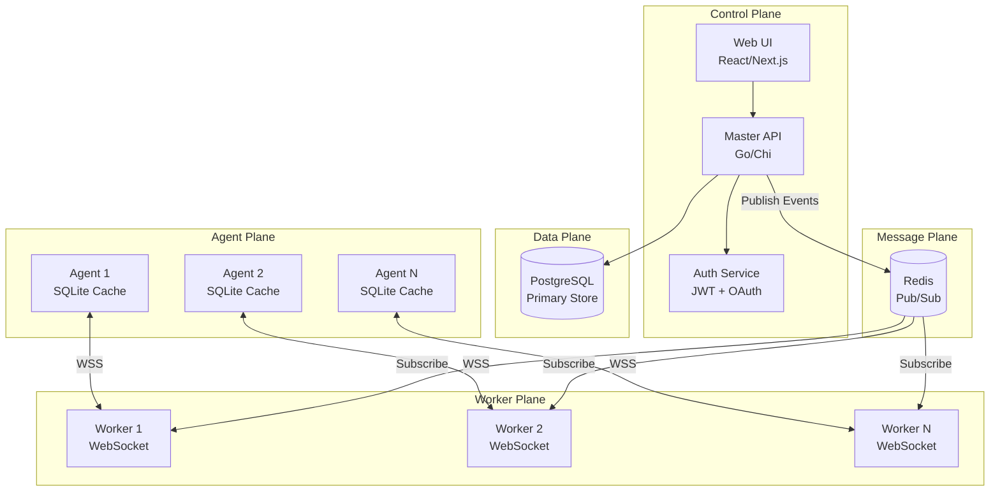
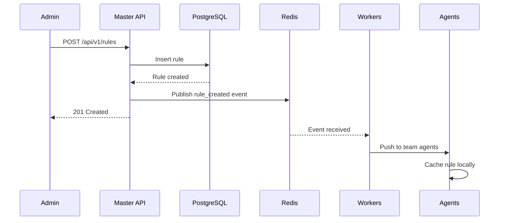
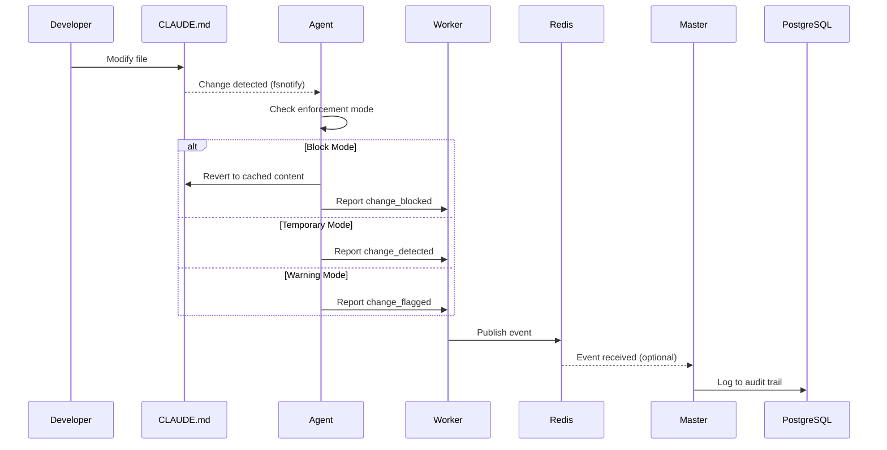
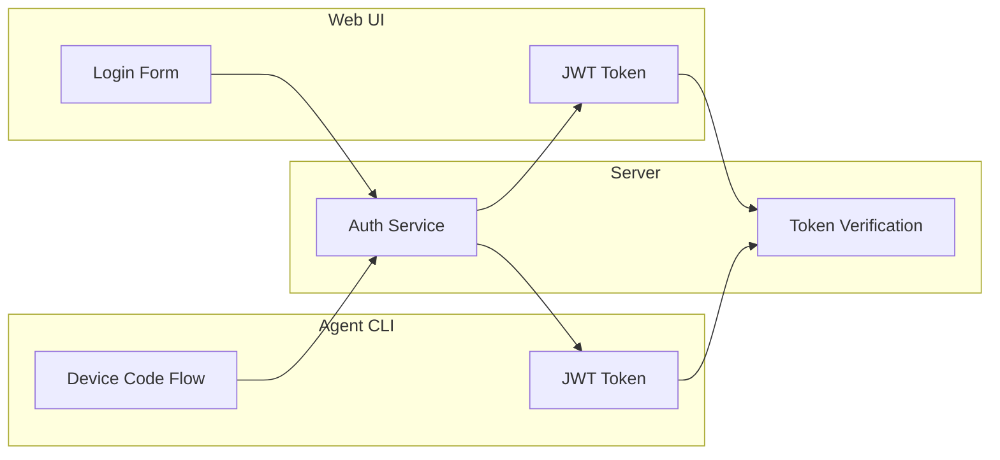
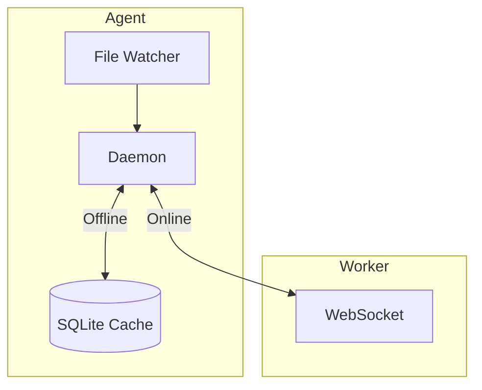
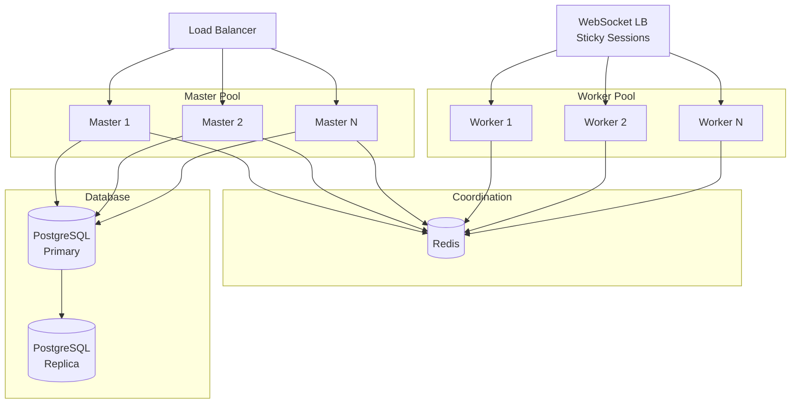

# Architecture

Edictflow follows a hub-and-spoke architecture with a central server and distributed agents, designed for horizontal scalability.

## System Overview



## Master-Worker Architecture

Edictflow uses a master-worker architecture for horizontal scalability:

| Process | Responsibility | Stateless | Scales To |
|---------|----------------|-----------|-----------|
| **Master** | REST API, business logic, database operations | Yes | N instances |
| **Worker** | WebSocket connections, real-time updates | Yes | N instances |
| **Redis** | Event coordination, pub/sub | N/A | Cluster mode |

### Masters

Masters handle:
- All REST API requests
- Authentication and authorization
- Database read/write operations
- Publishing events to Redis on data changes

Masters are stateless and can be load-balanced with any strategy.

### Workers

Workers handle:
- WebSocket connections from agents
- Subscribing to Redis channels for team events
- Broadcasting updates to connected agents
- Health monitoring of agent connections

Workers are stateless - agents can connect to any worker and receive events for their team.

### Redis Coordination

Redis provides:
- Pub/sub channels for team-specific events
- Channel naming: `team:{team_id}:rules`, `team:{team_id}:categories`
- Broadcast channel for global events: `broadcast:all`
- Direct agent messaging: `agent:{agent_id}:direct`

## Components

### Server (Master Process)

The master process handles API operations:

| Component | Technology | Purpose |
|-----------|------------|---------|
| REST API | Go + Chi | CRUD operations for rules, users, teams |
| Auth Service | JWT + OAuth 2.0 | Authentication and authorization |
| Database | PostgreSQL | Persistent storage |
| Publisher | go-redis | Event publishing to Redis |

### Server (Worker Process)

The worker process handles real-time communication:

| Component | Technology | Purpose |
|-----------|------------|---------|
| WebSocket Hub | gorilla/websocket | Manage agent connections |
| Redis Subscriber | go-redis | Subscribe to team channels |
| Broadcaster | Go channels | Fan-out events to agents |

### Agent

The agent is a lightweight daemon that:

| Component | Technology | Purpose |
|-----------|------------|---------|
| CLI | Go + Cobra | User interaction |
| Daemon | Go | Background file monitoring |
| File Watcher | fsnotify | Detect file changes |
| Local Cache | SQLite | Offline operation support |
| WebSocket Client | gorilla/websocket | Server communication |

### Web UI

The web interface provides:

| Feature | Technology | Purpose |
|---------|------------|---------|
| Dashboard | React/Next.js | Overview and quick actions |
| Rule Editor | Monaco Editor | Edit CLAUDE.md content |
| User Management | React | Manage users and roles |
| Audit Log | React | View change history |
| Graph View | React Flow | Visualize organization hierarchy |
| Command Palette | React | Quick navigation (`Ctrl+K`) |

## Data Flow

### Rule Creation (with Master-Worker)



### File Change Detection



## Enforcement Modes

Edictflow supports three enforcement modes:

| Mode | Behavior | Use Case |
|------|----------|----------|
| **Block** | Immediately revert unauthorized changes | Production configurations |
| **Temporary** | Allow changes, flag for review | Development/testing |
| **Warning** | Log changes without intervention | Monitoring/gradual rollout |

## Security Model

### Authentication



### Authorization (RBAC)

Permissions are hierarchical:

```
super_admin
├── manage_users
├── manage_teams
├── manage_roles
└── admin
    ├── manage_rules
    ├── approve_changes
    └── user
        ├── view_rules
        ├── request_changes
        └── view_changes
```

## Offline Operation

Agents maintain local SQLite caches for resilience:



When offline:

1. Agent uses cached rules
2. Changes are queued locally
3. Sync occurs on reconnection

## Scalability

### Horizontal Scaling



### Scaling Guidelines

| Component | Scaling Strategy | Notes |
|-----------|-----------------|-------|
| Masters | Add instances behind load balancer | Any LB strategy works |
| Workers | Add instances, use sticky sessions for WebSocket | Agents auto-reconnect |
| Redis | Use Redis Cluster for high availability | Built-in pub/sub support |
| PostgreSQL | Read replicas for scaling reads | Primary for writes |

## Technology Stack

| Layer | Technology | Why |
|-------|------------|-----|
| Master | Go | Performance, single binary, goroutines |
| Worker | Go | Efficient WebSocket handling |
| Router | Chi | Lightweight, idiomatic Go |
| Pub/Sub | Redis | Fast, reliable, built-in pub/sub |
| Database | PostgreSQL | Reliability, JSON support, migrations |
| Agent DB | SQLite | Zero-config, embedded, reliable |
| Web UI | Next.js 16 | React 19 ecosystem, SSR, fast development |
| Graph Visualization | React Flow | Interactive node-based diagrams |
| Styling | Tailwind CSS 4 | Utility-first CSS framework |
| Auth | JWT + OAuth 2.0 | Stateless, standard protocols |
| Real-time | WebSocket | Bidirectional, low latency |
| File Watch | fsnotify | Cross-platform, efficient |

## Directory Structure

```
edictflow/
├── server/           # Go server
│   ├── cmd/
│   │   ├── master/   # Master API entrypoint
│   │   ├── worker/   # Worker WebSocket entrypoint
│   │   └── server/   # Legacy combined server
│   ├── entrypoints/  # HTTP handlers
│   ├── services/     # Business logic
│   │   └── publisher/ # Redis event publisher
│   ├── worker/       # Worker hub and handler
│   ├── adapters/
│   │   ├── postgres/ # Database layer
│   │   └── redis/    # Redis client
│   ├── events/       # Event types
│   └── migrations/   # SQL migrations
├── agent/            # Go agent
│   ├── cmd/          # Entry points
│   ├── entrypoints/  # CLI commands
│   ├── daemon/       # Background service
│   └── watcher/      # File monitoring
├── web/              # Next.js frontend
│   ├── src/          # React components
│   └── public/       # Static assets
├── e2e/              # E2E tests
└── docs/             # Documentation
```
