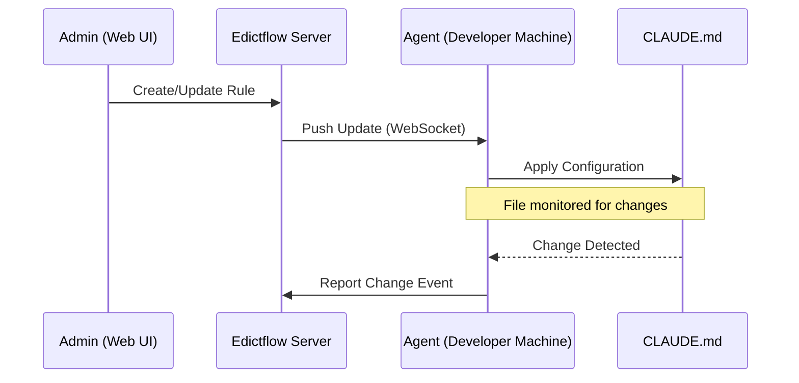

# Getting Started

Welcome to Edictflow! This guide will help you get up and running with centralized CLAUDE.md configuration management.

## Overview

Edictflow consists of two main components:

1. **Server** - The central hub that stores rules, manages users, and coordinates synchronization
2. **Agent** - A lightweight daemon that runs on developer machines and syncs configurations



## Choose Your Path

<div class="grid" markdown>

<div class="card" markdown>

### I'm an Administrator

Setting up Edictflow for your organization?

1. [Check Prerequisites](prerequisites.md)
2. [Deploy the Server](../admin/deployment.md)
3. [Configure Users & Teams](../admin/users.md)
4. [Create Your First Rules](../features/rules.md)

[Start Server Setup :material-arrow-right:](../admin/deployment.md){ .md-button }

</div>

<div class="card" markdown>

### I'm a Developer

Joining an existing Edictflow deployment?

1. [Check Prerequisites](prerequisites.md)
2. [Install the Agent](../user/installation.md)
3. [Authenticate with Your Server](../user/cli.md#login)
4. [Start the Agent Daemon](../user/cli.md#start)

[Install Agent :material-arrow-right:](../user/installation.md){ .md-button }

</div>

</div>

## Quick Start (5 minutes)

For evaluation or development, you can run everything locally with Docker:

```bash
# Clone the repository
git clone https://github.com/kamilrybacki/edictflow.git
cd edictflow

# Install task runner (if not already installed)
brew install go-task  # macOS
# or: go install github.com/go-task/task/v3/cmd/task@latest

# Start all services
task dev
```

This starts:

- **PostgreSQL** database on a dynamic port
- **Redis** for pub/sub on a dynamic port
- **Master** API on port 8080 (or next available)
- **Workers** for WebSocket connections
- **Web UI** on port 3000 (or next available)

Check the output for exact ports:

```
Services running:
  - Web UI:   http://localhost:3000
  - API:      http://localhost:8080
  - Database: localhost:5432
```

## Next Steps

After getting Edictflow running:

1. **Create a Team** - Organize users and rules by team
2. **Add Users** - Invite team members and assign roles
3. **Define Rules** - Create configuration rules for CLAUDE.md
4. **Install Agents** - Deploy agents to developer machines
5. **Monitor** - Use the audit log to track changes

## Architecture Deep Dive

For a detailed understanding of how Edictflow works, see the [Architecture](architecture.md) page.
