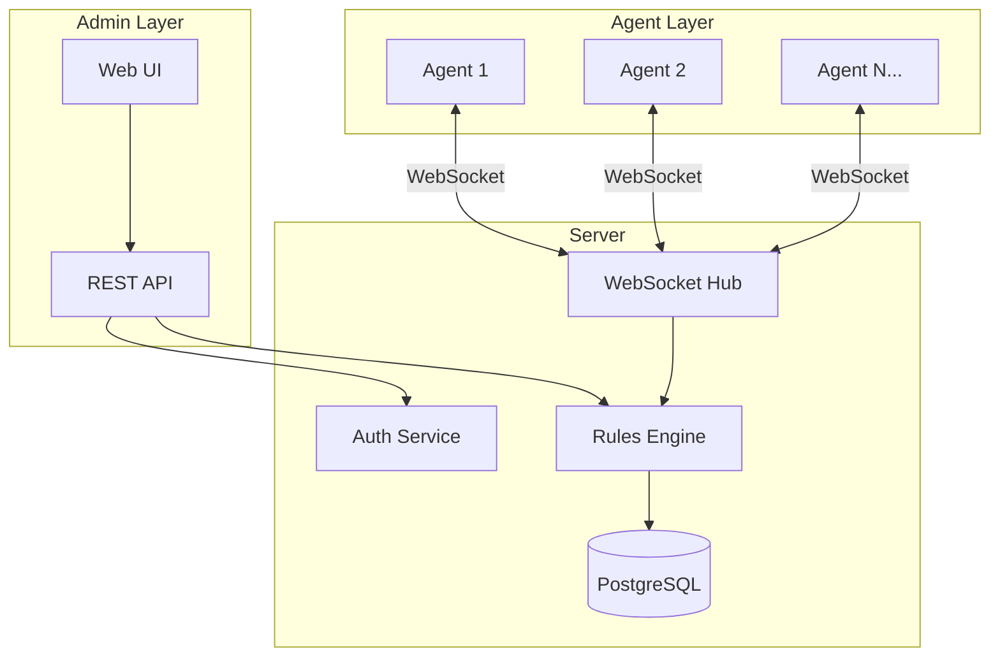

# Edictflow

<div class="hero" markdown>

# Centralized CLAUDE.md Configuration Management

Manage, distribute, and enforce CLAUDE.md configurations across your entire development organization with real-time synchronization and granular access control.

[Get Started](getting-started/index.md){ .md-button .md-button--primary }
[View on GitHub](https://github.com/kamilrybacki/edictflow){ .md-button }

</div>

---

## What is Edictflow?

Edictflow is a centralized configuration management system designed specifically for managing CLAUDE.md files across development teams. It provides:

- **Centralized Rule Management** - Define and manage configuration rules from a single admin interface
- **Real-time Synchronization** - Changes propagate instantly to all connected agents via WebSocket
- **Enforcement Modes** - Choose between blocking, temporary, or warning modes for each rule
- **Role-Based Access Control** - Fine-grained permissions with hierarchical roles
- **Audit Logging** - Complete visibility into all configuration changes
- **Multi-Team Support** - Organize users and rules by teams

## Architecture Overview



## Key Features

<div class="grid" markdown>

<div class="card" markdown>

### Real-time Sync

Changes to rules propagate instantly to all connected agents. No polling, no delays - just immediate updates via WebSocket connections.

</div>

<div class="card" markdown>

### Enforcement Modes

Choose how strictly rules are enforced:

- **Block** - Revert unauthorized changes
- **Temporary** - Allow changes temporarily
- **Warning** - Log changes without blocking

</div>

<div class="card" markdown>

### RBAC

Hierarchical role-based access control with customizable permissions. Define who can view, edit, or manage configurations.

</div>

<div class="card" markdown>

### Audit Trail

Complete audit logging of all changes. Know who changed what, when, and why - essential for compliance and debugging.

</div>

<div class="card" markdown>

### Graph View

Visualize your organization's hierarchy with an interactive graph. See teams, users, and rules in a React Flow-powered interface with filtering and navigation.

</div>

<div class="card" markdown>

### Command Palette

Quick navigation with `Ctrl+K` / `Cmd+K` keyboard shortcut. Search and jump to any page, team, or rule instantly.

</div>

</div>

## Quick Start

=== "Install Agent"

    ```bash
    # Download the agent binary
    curl -fsSL https://github.com/kamilrybacki/edictflow/releases/latest/download/agent-$(uname -s)-$(uname -m) -o edictflow-agent
    chmod +x edictflow-agent

    # Authenticate with your server
    ./edictflow-agent login https://your-server.example.com

    # Start the agent daemon
    ./edictflow-agent start
    ```

=== "Deploy Server"

    ```bash
    # Clone the repository
    git clone https://github.com/kamilrybacki/edictflow.git
    cd edictflow

    # Start with Docker Compose
    task dev
    ```

See the [Getting Started Guide](getting-started/index.md) for detailed instructions.

## Who is this for?

Edictflow is designed for:

- **Development Teams** using Claude AI assistants who need consistent CLAUDE.md configurations
- **Organizations** that require centralized control over AI assistant behavior
- **Platform Teams** managing developer environments at scale
- **Security Teams** needing audit trails and enforcement of AI configurations

## Documentation Sections

| Section | Description |
|---------|-------------|
| [Getting Started](getting-started/index.md) | Prerequisites, installation, and first steps |
| [Administrator Guide](admin/index.md) | Server deployment, configuration, and management |
| [User Guide](user/index.md) | Agent installation, CLI usage, and workflows |
| [Features](features/index.md) | Deep dive into rules, enforcement, triggers, graph view, and more |
| [API Reference](api/index.md) | REST API and WebSocket documentation |
| [Development](development/index.md) | Contributing, local setup, and testing |

## License

Edictflow is open source software licensed under the MIT License.
