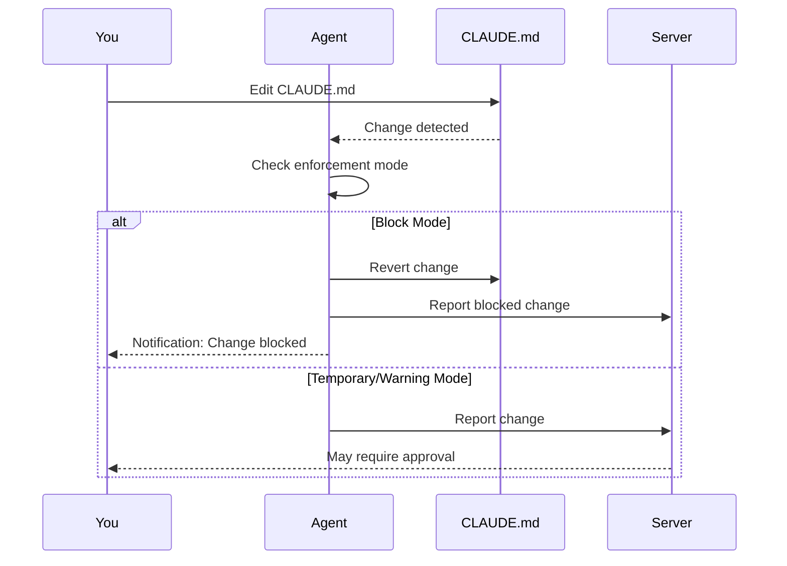

# User Guide

This guide covers installing and using the Edictflow agent on your development machine.

## Overview

The Edictflow agent is a lightweight daemon that:

- Syncs CLAUDE.md configurations from your organization's server
- Monitors configured files for changes
- Enforces rules based on your team's policies
- Reports changes back to the server

## Quick Navigation

<div class="grid" markdown>

<div class="card" markdown>

### [Installation](installation.md)

Download and install the agent on your machine.

</div>

<div class="card" markdown>

### [CLI Commands](cli.md)

Reference for all agent CLI commands.

</div>

<div class="card" markdown>

### [Workflow](workflow.md)

Day-to-day usage and best practices.

</div>

<div class="card" markdown>

### [Troubleshooting](troubleshooting.md)

Common issues and solutions.

</div>

</div>

## Getting Started

### 1. Install the Agent

Download the agent for your platform:

=== "macOS"

    ```bash
    curl -fsSL https://github.com/kamilrybacki/edictflow/releases/latest/download/agent-darwin-amd64 -o edictflow-agent
    chmod +x edictflow-agent
    sudo mv edictflow-agent /usr/local/bin/
    ```

=== "Linux"

    ```bash
    curl -fsSL https://github.com/kamilrybacki/edictflow/releases/latest/download/agent-linux-amd64 -o edictflow-agent
    chmod +x edictflow-agent
    sudo mv edictflow-agent /usr/local/bin/
    ```

=== "Windows"

    ```powershell
    Invoke-WebRequest -Uri "https://github.com/kamilrybacki/edictflow/releases/latest/download/agent-windows-amd64.exe" -OutFile "edictflow-agent.exe"
    ```

### 2. Authenticate

Connect to your organization's Edictflow server:

```bash
edictflow-agent login https://edictflow.yourcompany.com
```

This opens your browser to complete authentication.

### 3. Start the Agent

Run the agent as a background daemon:

```bash
edictflow-agent start
```

The agent will:

1. Connect to the server
2. Download your team's rules
3. Begin monitoring configured files

### 4. Verify

Check the agent status:

```bash
edictflow-agent status
```

You should see:

```
Agent Status: Running
Server: https://edictflow.yourcompany.com
Connected: Yes
Rules: 3 active
Last sync: 2 minutes ago
```

## What Happens Next

Once running, the agent:

- **Syncs rules** from the server in real-time via WebSocket
- **Monitors files** specified in rule triggers
- **Enforces policies** according to enforcement mode:
  - **Block**: Reverts unauthorized changes
  - **Temporary**: Allows changes, flags for review
  - **Warning**: Logs changes without intervention

## Typical Workflow



## Need Help?

- [Web UI](../web-ui/index.md) - Browse rules, view changes, and manage approvals from the browser
- [CLI Reference](cli.md) - Complete command documentation
- [Troubleshooting](troubleshooting.md) - Common issues and fixes
- [Workflow Guide](workflow.md) - Best practices for daily use
