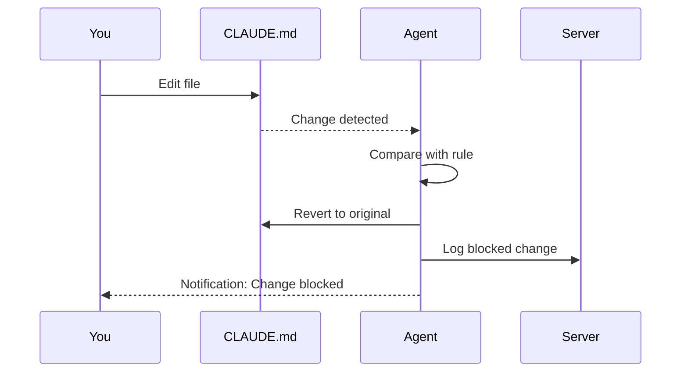
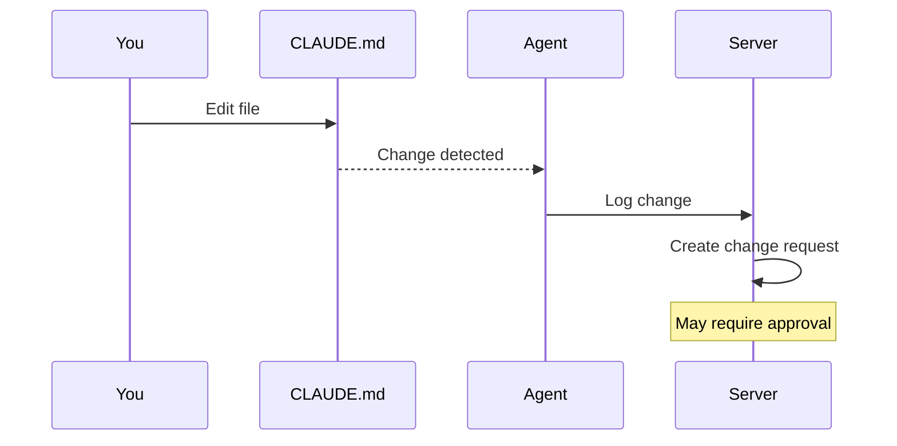

# Workflow

Best practices for using Edictflow in your daily development workflow.

## Day-to-Day Usage

### Starting Your Day

1. **Verify agent is running:**
   ```bash
   edictflow-agent status
   ```

2. **Check for rule updates:**
   ```bash
   edictflow-agent sync
   ```

3. **Start coding!** The agent works in the background.

### Agent Status Indicators

When the agent is running, you may see notifications for:

| Event | Meaning | Action Required |
|-------|---------|-----------------|
| Change blocked | Your edit was reverted | See why the change was blocked |
| Change detected | Your edit was logged | May require approval |
| Change flagged | Your edit was noted | For informational purposes |
| Sync complete | Rules were updated | No action needed |

## Understanding Enforcement Modes

### Block Mode

Rules in block mode enforce strict compliance:



**What this means for you:**

- Your changes will be immediately reverted
- The original content is restored
- The event is logged on the server
- You'll receive a notification

**If you need to make changes:**

1. Contact your team admin
2. Request a rule change or exception
3. Wait for approval before editing

### Temporary Mode

Rules in temporary mode allow changes but track them:



**What this means for you:**

- Your changes are kept
- The change is logged
- May require admin approval
- Could be reverted later if rejected

### Warning Mode

Rules in warning mode are purely informational:

- Changes are kept
- Events are logged
- No action required from you
- Useful for monitoring compliance

## Requesting Changes

If you need to modify a file governed by a rule:

### 1. Check Current Rule

```bash
edictflow-agent rules
```

Identify which rule applies to your file.

### 2. Make Your Change

Edit the file as normal.

### 3. Check Status

If the rule is in block mode, your change was reverted.

For temporary mode:

```bash
edictflow-agent changes --limit 1
```

View the change request status.

### 4. Request Approval

Contact your team admin through your organization's process:

- Slack/Teams message
- JIRA ticket
- Email
- Web UI approval request

### 5. Wait for Approval

Once approved, your change will be:

- Accepted into the new rule version
- Or granted as an exception

## Working Offline

The agent caches rules locally and works offline:

### When Online

- Real-time rule sync via WebSocket
- Changes reported immediately
- Full functionality

### When Offline

- Uses cached rules
- Changes queued locally
- Enforcement continues
- Syncs when reconnected

### Check Connection Status

```bash
edictflow-agent status
```

Look for `Connected: Yes/No` in the output.

## Multiple Projects

The agent monitors files across all your projects:

### Project-Specific Rules

Rules can target specific paths:

```
triggers:
  - /home/user/project-a/CLAUDE.md
  - /home/user/project-b/**/CLAUDE.md
```

### Team-Based Rules

Your team assignment determines which rules apply:

- Engineering team → Engineering rules
- Platform team → Platform rules
- Multi-team members → All applicable rules

## Best Practices

### 1. Keep the Agent Running

Run the agent as a service so it starts automatically:

=== "macOS"

    ```bash
    launchctl load ~/Library/LaunchAgents/com.edictflow.agent.plist
    ```

=== "Linux"

    ```bash
    systemctl --user enable edictflow-agent
    ```

### 2. Check Status Regularly

```bash
# Add to your shell profile
alias cc-status='edictflow-agent status'
```

### 3. Sync Before Major Work

Before starting significant work:

```bash
edictflow-agent sync --force
```

Ensures you have the latest rules.

### 4. Understand Your Rules

Review active rules:

```bash
edictflow-agent rules
```

Know what's enforced and why.

### 5. Communicate Changes

When you need rule modifications:

1. Explain the business need
2. Propose specific changes
3. Wait for approval
4. Don't work around enforcement

## Integration with Git

### Pre-commit Hooks

Validate before committing:

```bash
#!/bin/sh
# .git/hooks/pre-commit

edictflow-agent validate || {
    echo "Edictflow validation failed"
    exit 1
}
```

### CI/CD Integration

Add validation to CI pipelines:

```yaml
# .github/workflows/validate.yml
jobs:
  validate:
    runs-on: ubuntu-latest
    steps:
      - uses: actions/checkout@v4
      - name: Install Edictflow Agent
        run: |
          curl -fsSL https://github.com/kamilrybacki/edictflow/releases/latest/download/agent-linux-amd64 -o agent
          chmod +x agent
      - name: Validate
        run: ./agent validate --json
```

## Common Scenarios

### Scenario: Need to Update CLAUDE.md

1. Check the rule: `edictflow-agent rules`
2. If block mode: Contact admin for approval
3. If temporary: Make change, request approval
4. If warning: Make change, document reason

### Scenario: Agent Won't Connect

1. Check credentials: `edictflow-agent status`
2. Try re-login: `edictflow-agent logout && edictflow-agent login <url>`
3. Check network: Verify server is reachable
4. See [Troubleshooting](troubleshooting.md)

### Scenario: Unexpected Reverts

1. Check which rule triggered: `edictflow-agent changes --limit 1`
2. Review rule content: `edictflow-agent rules`
3. Understand why your change conflicted
4. Request rule modification if needed

### Scenario: New Team Member

1. Install agent: [Installation Guide](installation.md)
2. Get server URL from team lead
3. Login: `edictflow-agent login <url>`
4. Start agent: `edictflow-agent start`
5. Review rules: `edictflow-agent rules`

## Notifications

### Desktop Notifications

Enable desktop notifications for important events:

```bash
edictflow-agent config set notifications.desktop true
```

### Log File

View detailed logs:

```bash
# macOS
tail -f ~/Library/Logs/edictflow-agent.log

# Linux
tail -f ~/.local/share/edictflow/agent.log
```

### Webhook Integration

Configure personal webhooks (if enabled by admin):

```bash
edictflow-agent config set notifications.webhook https://your-webhook.example.com
```
